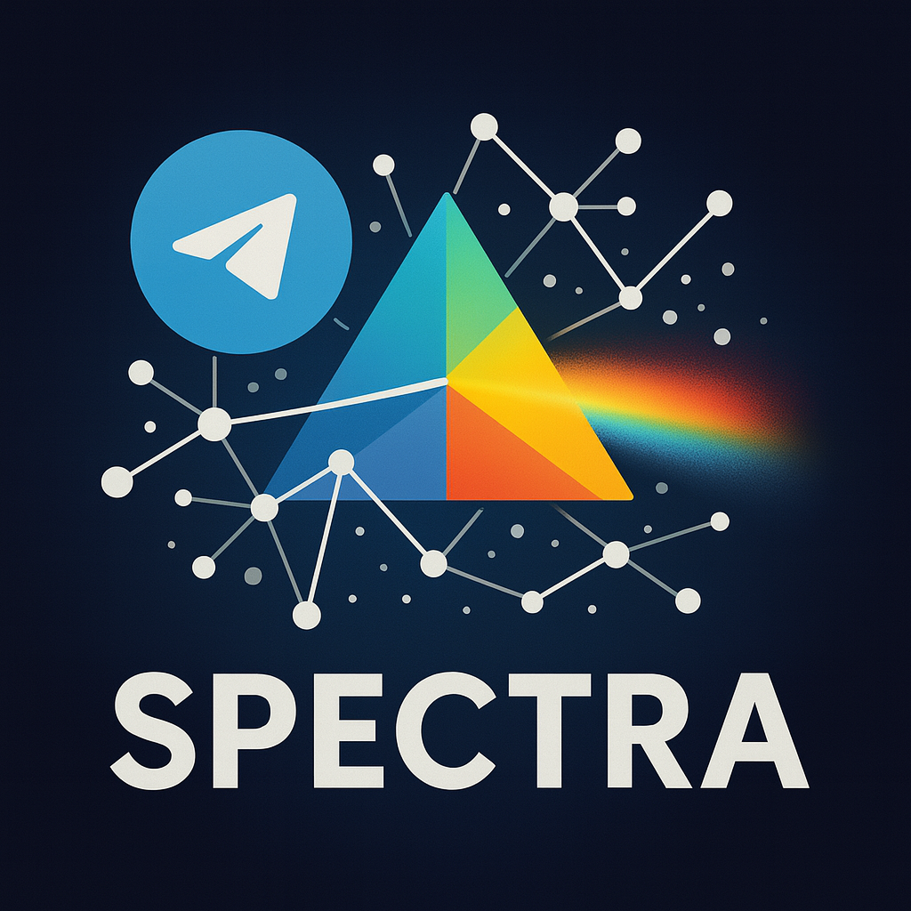

# SPECTRA

**Spectrally-Processing Extraction, Crawling, & Tele-Reconnaissance Archive**

SPECTRA is an advanced framework for Telegram data collection, network discovery, and forensic-grade archiving with multi-account support, graph-based targeting, and robust OPSEC features.

<p align="center">
  
</p>

## Features

- 🔄 **Multi-account & API key rotation** with smart, persistent selection and failure detection
- 🕵️ **Proxy rotation** for OPSEC and anti-detection
- 🔎 **Network discovery** of connected groups and channels (with SQL audit trail)
- 📊 **Graph/network analysis** to identify high-value targets
- 📁 **Forensic archiving** with integrity checksums and sidecar metadata
- 📱 **Topic/thread support** for complete conversation capture
- 🗄️ **SQL database storage** for all discovered groups, relationships, and archive metadata
- ⚡ **Parallel processing** leveraging multiple accounts and proxies simultaneously
- 🖥️ **Modern TUI** (npyscreen) and CLI, both using the same modular backend
- ⚙️ **Streamlined Account Management** - Full CRUD operations directly in the TUI with keyboard shortcuts
- ☁️ **Forwarding Mode:** Traverse a series of channels, discover related channels, and download text/archive files with specific rules, using a single API key.
- 🛡️ **Red team/OPSEC features**: account/proxy rotation, SQL audit trail, sidecar metadata, persistent state

## ⚡ Quick Start

**Root launchers:**

```bash
# Clone and enter directory
git clone https://github.com/SWORDIntel/SPECTRA.git
cd SPECTRA

# Main web console
./spectra

# Documentation launcher
python3 webapp.py
```

`./spectra` is the primary entry point for the web console. `python3 webapp.py` opens the documentation shell and lands on `/docs`.

## Local GUI

The repository also includes a local web launcher for orchestration, status, and documentation:

```bash
./spectra
```

Optional API key protection:

```bash
export SPECTRA_GUI_API_KEY="change-me"
./spectra --api-key "$SPECTRA_GUI_API_KEY"
```

Standard machine-readable API surfaces:

- `/openapi.json`
- `/.well-known/openapi.json`
- `/docs`

## Installation

```bash
# Clone the repository
git clone https://github.com/SWORDIntel/SPECTRA.git
cd SPECTRA

# Create virtual environment
python3 -m venv .venv
source .venv/bin/activate

# Install core dependencies (recommended - stable)
pip install telethon rich pillow pandas networkx matplotlib python-magic pyaes pyasn1 feedgen lxml imagehash croniter npyscreen pysocks

# OR install all dependencies (may require system packages)
pip install -r requirements.txt

# Install package in development mode
pip install -e .
```

## Configuration

SPECTRA supports multi-account configuration with automatic account import from `gen_config.py` (TELESMASHER-compatible) and persistent SQL storage for all operations.

### Setting up Telegram API access

1. Visit https://my.telegram.org/apps to register your application
2. Create a config file or use the built-in account import:

```bash
# Import accounts from gen_config.py
python -m tgarchive accounts --import
```

## System Status

**Current Version**: 2025-01-XX (Production Ready)
- ✅ **Core System**: Fully operational with all syntax errors resolved
- ✅ **CLI Interface**: 18 commands available and tested
- ✅ **Dependencies**: Core dependencies installed and verified
- ✅ **Architecture**: Professional-grade modular design validated
- ✅ **CNSA 2.0 Compliance**: All cryptographic operations updated

**Recent Enhancements (2025-01-XX)**:
- Fixed critical Git merge conflicts blocking system startup
- Resolved CLI parser conflicts and syntax errors
- Validated full system functionality and dependency chain
- See [CHANGELOG.md](docs/reference/CHANGELOG.md) for complete details

## Documentation

### 📚 [Full Documentation Site](https://swordintel.github.io/SPECTRA/)

**Complete HTML documentation built with [Docusaurus](https://docusaurus.io/) - a modern static site generator with:**
- 🔍 **Full-text search** across all documentation
- 🌙 **Dark theme** (default) with light mode toggle
- 📱 **Responsive design** for mobile and desktop
- 🧭 **Interactive navigation** with organized sidebar
- ⚡ **Fast loading** with optimized static HTML
- 🔗 **Versioning support** for future releases

**For local development:**
```bash
cd docs
npm install          # Install Docusaurus dependencies
npm start            # Start development server (http://localhost:3000)
npm run build        # Build static HTML to docs/html/
```

**Documentation Framework:**
- Built with Docusaurus 3.x
- Source files: `docs/docs/` (markdown with frontmatter)
- Configuration: `docs/docusaurus.config.js`
- Build output: `docs/html/` (generated HTML files)
- Root entry point: `index.html` (redirects to documentation)

### Quick Links

#### Getting Started
- **[Installation Guide](docs/docs/getting-started/installation.md)** - Complete installation instructions
- **[Quick Start Guide](docs/docs/getting-started/quick-start.md)** - Get running in 30 seconds
- **[Configuration Guide](docs/docs/getting-started/configuration.md)** - Setting up API keys and accounts

#### User Guides
- **[TUI Usage Guide](docs/docs/guides/tui-usage.md)** - Complete guide to using the Terminal User Interface
- **[Forwarding Guide](docs/docs/guides/forwarding.md)** - Message forwarding and deduplication features
- **[CLI Reference](docs/docs/api/cli-reference.md)** - Complete command-line interface documentation

#### Features
- **[Advanced Features](docs/docs/features/advanced-features.md)** - AI/ML intelligence, threat scoring, vector databases, and more

### Legacy Documentation

Original markdown files are still available in:
- `docs/guides/` — User guides and walkthroughs
- `docs/reference/` — Technical reference documentation
- `docs/features/` — Feature documentation
- `docs/reports/` — Security summaries and integration reports
- `docs/roadmap/` — Long-term initiatives and backlog
- `docs/research/` — Strategic research documents

## Project Layout

```
SPECTRA/
├── spectra              ← Main launcher for the local web console
├── webapp.py            ← Documentation launcher (`/docs`)
├── spectra.sh           ← Compatibility wrapper
├── tgarchive/           ← Core CLI/TUI/archive/forwarding package
├── src/spectra_app/     ← Web launcher and orchestration implementation
├── spectra_app/         ← Compatibility package for repo-root imports
├── templates/           ← Shared web UI templates
├── docs/                ← Docusaurus source and compatibility docs
├── scripts/             ← Install, launch, and maintenance helpers
├── examples/            ← Example scripts
├── tests/               ← Repo-level smoke/integration scripts
├── deployment/          ← Docker/system deployment assets
├── bootstrap            ← Bootstrap entrypoint
├── index.html           ← Root redirect into the documentation site
├── Makefile             ← Common development commands
├── setup.py             ← Packaging entrypoint
└── CONTRIBUTING.md      ← Development workflow guide
```

Local runtime output such as `logs/`, `spectra_venv/`, and `spectra_config.json` is intentionally kept out of version control.

For detailed structure explanation, see [PROJECT_STRUCTURE.md](docs/reference/PROJECT_STRUCTURE.md)

## Integration & Architecture

- **`SPECTRA/tgarchive/discovery.py`**: Integration point for group crawling, network analysis, parallel archiving, and SQL-backed state
- **`SPECTRA/tgarchive/__main__.py`**: Unified CLI/TUI entry point
- **`examples/parallel_example.py`**: Example for parallel, multi-account operations
- All modules are importable and can be reused in your own scripts or pipelines

## Contributing

See [CONTRIBUTING.md](CONTRIBUTING.md) for development workflow and verification guidance.

## License

This project is licensed under the MIT License - see the LICENSE file for details.
