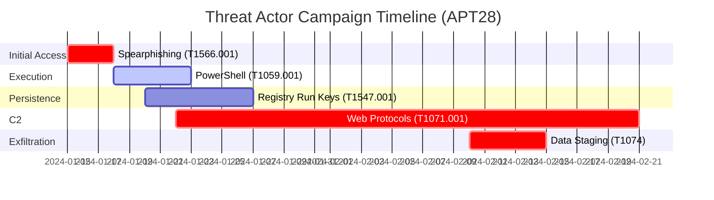
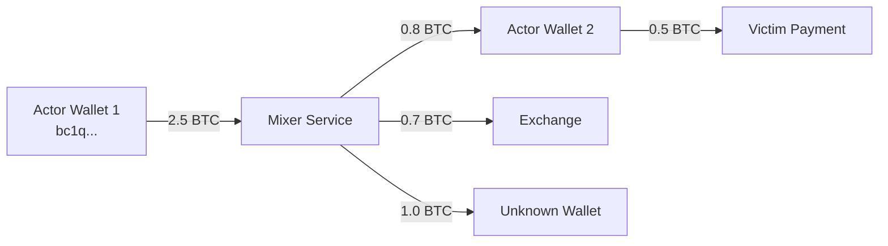

# SPECTRA Advanced Enhancements Plan

**Version:** 1.0
**Date:** 2025-11-16
**Focus Areas:** Vector Database Integration, CNSA 2.0 Compliance, Enhanced Threat Tracking

---

## Executive Summary

This document outlines three major enhancement tracks for SPECTRA:

1. **Dual-Database Architecture**: Adding a specialized vector database (384-2048D) alongside SQLite for high-performance similarity search
2. **CNSA 2.0 Compliance**: Implementing post-quantum cryptography (ML-KEM-1024, ML-DSA-87) and SHA-384
3. **Advanced Threat Tracking**: Enhanced tools for actor profiling, attribution, and predictive analysis

**Recommendation:** Implement all three tracks in parallel for maximum impact.

---

## 1. Vector Database Architecture Evaluation

### 1.1 Problem Statement

**Current Limitations:**
- SQLite is excellent for structured data, metadata, and relational queries
- High-dimensional vector operations (384-2048D embeddings) are inefficient in SQLite
- Semantic search requires loading all vectors into memory (doesn't scale beyond millions of records)
- No native support for approximate nearest neighbor (ANN) search

**Use Cases Requiring Vector DB:**
- Semantic message search across millions of documents
- Entity similarity and clustering
- Behavioral pattern matching
- Anomaly detection based on embedding space
- Cross-lingual semantic search (multilingual embeddings)
- Image/media similarity search (if analyzing media)

### 1.2 Architecture Decision: Hybrid Dual-Database

**RECOMMENDATION: Keep SQLite + Add Specialized Vector Database**

```
┌─────────────────────────────────────────────────────────┐
│                    SPECTRA Application                  │
└─────────────────┬───────────────────────┬───────────────┘
                  │                       │
         ┌────────▼────────┐     ┌───────▼────────┐
         │  SQLite (Primary)│     │  Vector Store  │
         │                 │     │  (Secondary)   │
         ├─────────────────┤     ├────────────────┤
         │ • Metadata      │     │ • Embeddings   │
         │ • Relations     │     │ • Similarity   │
         │ • Audit logs    │     │ • Clustering   │
         │ • User data     │     │ • ANN search   │
         │ • Threat scores │     │ • Semantic ops │
         │ • Direct SQL    │     │ • Fast vectors │
         └─────────────────┘     └────────────────┘
                  │                       │
                  └───────────┬───────────┘
                              │
                    Unified Query Layer
                    (Hybrid Results)
```

**Key Principle:** Each database does what it does best
- **SQLite**: Structured data, exact queries, metadata, relationships, audit trail
- **Vector DB**: High-dimensional similarity, semantic search, clustering, embeddings

**Reference Architecture:**
```python
# Message ID is the common key between both databases

# SQLite stores:
{
    "message_id": 12345,
    "user_id": 1001,
    "channel_id": 5000,
    "text": "Discussing zero-day exploit...",
    "date": "2024-06-15",
    "threat_score": 9.5,
    "metadata": {...}
}

# Vector DB stores:
{
    "id": "msg_12345",  # References SQLite message_id
    "vector": [0.123, -0.456, ...],  # 384-2048 dimensions
    "metadata": {
        "message_id": 12345,
        "user_id": 1001,
        "threat_score": 9.5  # Denormalized for filtering
    }
}

# Query flow:
1. Vector DB: Find similar embeddings (ANN search)
   → Returns: [msg_12345, msg_67890, msg_11111]
2. SQLite: Fetch full metadata for these IDs
   → Returns: Complete message data
3. Combine and rank results
```

### 1.3 Vector Database Comparison

| Feature | **Qdrant** | **Milvus** | **ChromaDB** | **Weaviate** |
|---------|----------|---------|----------|-----------|
| **Deployment** | 🟢 Single binary | 🟡 Complex (needs dependencies) | 🟢 Embedded/Server | 🟡 Docker required |
| **Performance** | 🟢 Excellent | 🟢 Excellent | 🟡 Good | 🟢 Excellent |
| **Scalability** | 🟢 Billions of vectors | 🟢 Trillions | 🟡 Millions | 🟢 Billions |
| **Filtering** | 🟢 Rich metadata filters | 🟢 Advanced | 🟢 Good | 🟢 Advanced |
| **Production Ready** | 🟢 Yes | 🟢 Yes | 🟡 Emerging | 🟢 Yes |
| **Python API** | 🟢 Excellent | 🟢 Excellent | 🟢 Excellent | 🟢 Excellent |
| **License** | 🟢 Apache 2.0 | 🟢 Apache 2.0 | 🟢 Apache 2.0 | 🟢 BSD-3 |
| **Local/Embedded** | 🟢 Yes | ❌ No | 🟢 Yes | ❌ No |
| **Resource Usage** | 🟢 Lightweight | 🔴 Heavy | 🟢 Lightweight | 🟡 Moderate |
| **HNSW Algorithm** | 🟢 Yes | 🟢 Yes | 🟢 Yes | 🟢 Yes |
| **Quantization** | 🟢 Scalar, Product | 🟢 Scalar, Product | 🟡 Basic | 🟢 Advanced |
| **Sharding** | 🟢 Built-in | 🟢 Built-in | ❌ No | 🟢 Built-in |

**RECOMMENDATION: Qdrant**

**Why Qdrant:**
1. ✅ **Embedded mode** - Can run in-process like SQLite (no separate server required)
2. ✅ **Single binary** - Easy deployment, no complex dependencies
3. ✅ **Production-grade performance** - Handles billions of vectors
4. ✅ **Advanced filtering** - Can filter by threat_score, date, user_id before vector search
5. ✅ **Payload storage** - Can store metadata alongside vectors
6. ✅ **Quantization** - Reduces memory usage (Scalar, Product Quantization)
7. ✅ **Python SDK** - Excellent API with type hints
8. ✅ **Open source** - Apache 2.0 license
9. ✅ **Persistence** - Automatic snapshots and WAL
10. ✅ **HNSW + IVF** - Multiple indexing algorithms

**Fallback Option: ChromaDB** (already in codebase, but less scalable)

### 1.4 Embedding Dimensions

| Dimension | Model Example | Use Case | Memory/1M vectors |
|-----------|--------------|----------|-------------------|
| **384D** | all-MiniLM-L6-v2 | General semantic search | ~1.5 GB |
| **768D** | all-mpnet-base-v2 | Higher quality semantic search | ~3.0 GB |
| **1024D** | OpenAI ada-002 | High-quality embeddings | ~4.0 GB |
| **1536D** | OpenAI text-embedding-3-small | Production semantic search | ~6.0 GB |
| **2048D** | Custom domain models | Specialized applications | ~8.0 GB |

**RECOMMENDATION:**
- **Default**: 384D (all-MiniLM-L6-v2) - Best balance of speed/quality
- **High-accuracy**: 768D (all-mpnet-base-v2) - Better semantic understanding
- **Production**: 1536D (OpenAI or similar) - Best quality for critical intel

### 1.5 Implementation Architecture

```python
# New module: tgarchive/db/vector_store.py

class VectorStoreManager:
    """Manages dual-database operations."""

    def __init__(self, sqlite_path: str, qdrant_path: str):
        self.sqlite = SQLiteDatabase(sqlite_path)
        self.qdrant = QdrantVectorStore(qdrant_path)

    def index_message(self, message_id: int, text: str, metadata: dict, embedding: np.ndarray):
        """Store in both databases."""
        # SQLite: structured data
        self.sqlite.insert_message(message_id, text, metadata)

        # Qdrant: vector + minimal metadata
        self.qdrant.upsert(
            id=f"msg_{message_id}",
            vector=embedding.tolist(),
            payload={
                "message_id": message_id,
                "user_id": metadata["user_id"],
                "threat_score": metadata.get("threat_score", 0),
                "date": metadata["date"]
            }
        )

    def semantic_search(self, query_embedding: np.ndarray,
                       top_k: int = 10,
                       filters: dict = None) -> List[dict]:
        """Hybrid search: Vector DB → SQLite enrichment."""

        # Step 1: Vector similarity search with filters
        qdrant_filters = self._build_qdrant_filters(filters)
        vector_results = self.qdrant.search(
            vector=query_embedding.tolist(),
            limit=top_k,
            query_filter=qdrant_filters
        )

        # Step 2: Fetch full data from SQLite
        message_ids = [int(r.payload["message_id"]) for r in vector_results]
        full_messages = self.sqlite.get_messages_by_ids(message_ids)

        # Step 3: Combine with similarity scores
        results = []
        for result, message in zip(vector_results, full_messages):
            results.append({
                **message,
                "similarity_score": result.score,
                "vector_id": result.id
            })

        return results

    def cluster_actors(self, user_ids: List[int]) -> Dict[int, List[int]]:
        """Cluster threat actors by behavioral similarity."""
        # Get embeddings for all messages from these users
        # Perform clustering in vector space
        # Return cluster assignments
        pass
```

**Query Patterns:**

```python
# 1. Semantic Search
results = vector_store.semantic_search(
    query_embedding=embed("zero-day exploits"),
    top_k=50,
    filters={
        "threat_score": {"gte": 7.0},  # Only high-risk actors
        "date": {"gte": "2024-01-01"}
    }
)

# 2. Similar Actor Detection
similar_actors = vector_store.find_similar_actors(
    actor_id=1001,
    similarity_threshold=0.85
)

# 3. Anomaly Detection
anomalies = vector_store.detect_anomalies(
    channel_id=5000,
    threshold=0.7  # Messages with low similarity to channel norm
)

# 4. Cluster Analysis
clusters = vector_store.cluster_messages(
    filters={"threat_score": {"gte": 8.0}},
    n_clusters=10
)
```

### 1.6 Migration Strategy

**Phase 1: Add Qdrant alongside SQLite (Weeks 1-2)**
- Install Qdrant Python client
- Create `VectorStoreManager` abstraction
- Implement dual-write (SQLite + Qdrant)
- Graceful degradation if Qdrant unavailable

**Phase 2: Backfill existing data (Weeks 3-4)**
- Batch process existing messages
- Generate embeddings (384D)
- Index into Qdrant
- Verify consistency

**Phase 3: Enhanced queries (Weeks 5-6)**
- Implement hybrid search
- Add clustering capabilities
- Anomaly detection
- Actor similarity

**Phase 4: Production optimization (Weeks 7-8)**
- Quantization for memory efficiency
- Sharding for scalability
- Snapshot/backup integration
- Performance tuning

### 1.7 Storage Requirements

**Example: 10 Million Messages**

| Component | Size | Notes |
|-----------|------|-------|
| SQLite (metadata) | ~5-10 GB | Text, structured data, indexes |
| Qdrant (384D vectors) | ~15 GB | Raw vectors |
| Qdrant (with quantization) | ~4 GB | 4x compression |
| **Total (unoptimized)** | ~20-25 GB | |
| **Total (optimized)** | ~10-15 GB | With quantization |

**100 Million Messages:** ~100-150 GB (optimized)

**Scalability:** Qdrant can handle billions of vectors with sharding.

---

## 2. CNSA 2.0 Compliance Implementation

### 2.1 CNSA 2.0 Requirements

**Commercial National Security Algorithm Suite 2.0 (CNSA 2.0)**
NSA directive for quantum-resistant cryptography.

**Mandatory Algorithms:**

| Function | CNSA 1.0 (Classical) | CNSA 2.0 (Quantum-Resistant) |
|----------|---------------------|----------------------------|
| **Encryption** | AES-256 | AES-256 + ML-KEM-1024 |
| **Key Exchange** | ECDH (P-384) | **ML-KEM-1024** (post-quantum) |
| **Digital Signature** | ECDSA (P-384) | **ML-DSA-87** (post-quantum) |
| **Hashing** | SHA-256/384 | **SHA-384** (minimum) |

**Key Standards:**
- **ML-KEM-1024**: FIPS 203 (Module-Lattice-Based Key Encapsulation Mechanism)
  - Formerly CRYSTALS-Kyber
  - Quantum-resistant key exchange
  - Security level: NIST Level 5 (256-bit quantum security)

- **ML-DSA-87**: FIPS 204 (Module-Lattice-Based Digital Signature Algorithm)
  - Formerly CRYSTALS-Dilithium
  - Quantum-resistant signatures
  - Parameter set: Dilithium5 (highest security)

- **SHA-384**: FIPS 180-4
  - 384-bit hash function
  - Collision resistance: 192-bit quantum security

### 2.2 Implementation Strategy

**Architecture Overview:**

```
┌─────────────────────────────────────────────────────────┐
│              SPECTRA Crypto Layer (CNSA 2.0)            │
├─────────────────────────────────────────────────────────┤
│                                                         │
│  ┌─────────────┐  ┌──────────────┐  ┌──────────────┐  │
│  │  ML-KEM-1024│  │  ML-DSA-87   │  │   SHA-384    │  │
│  │   (PQC KEM) │  │ (PQC Sigs)   │  │   (Hashing)  │  │
│  └─────────────┘  └──────────────┘  └──────────────┘  │
│                                                         │
│  ┌─────────────────────────────────────────────────┐  │
│  │         Hybrid Cryptography Layer               │  │
│  │  (PQC + Classical for backward compatibility)   │  │
│  └─────────────────────────────────────────────────┘  │
│                                                         │
└─────────────────────────────────────────────────────────┘
         │                    │                  │
         ▼                    ▼                  ▼
  Key Exchange      Message Signing      Data Integrity
  (Session keys)    (Authentication)     (Checksums)
```

**Use Cases in SPECTRA:**

1. **Encrypted Archives** (ML-KEM-1024)
   - Generate quantum-resistant session keys
   - Encrypt archived Telegram data
   - Protect against future quantum attacks

2. **Signed Intelligence Reports** (ML-DSA-87)
   - Digitally sign threat intelligence reports
   - Verify authenticity of analysis outputs
   - Non-repudiation for evidence chain

3. **Integrity Verification** (SHA-384)
   - Archive checksums
   - Database integrity checks
   - Audit log verification

### 2.3 Python Implementation

**Libraries:**
- **liboqs-python**: Open Quantum Safe project (ML-KEM, ML-DSA)
- **pqcrypto**: Pure Python PQC (fallback)
- **cryptography**: SHA-384, AES-256

```python
# New module: tgarchive/crypto/pqc.py

from oqs import KeyEncapsulation, Signature
import hashlib
from cryptography.hazmat.primitives.ciphers.aead import AESGCM
from dataclasses import dataclass
from typing import Tuple

@dataclass
class CNSAKeyPair:
    """CNSA 2.0 compliant key pair."""
    public_key: bytes
    secret_key: bytes
    algorithm: str  # "ML-KEM-1024" or "ML-DSA-87"

class CNSA20CryptoManager:
    """CNSA 2.0 compliant cryptographic operations."""

    def __init__(self):
        self.kem_algorithm = "ML-KEM-1024"  # FIPS 203
        self.sig_algorithm = "ML-DSA-87"    # FIPS 204
        self.hash_algorithm = "sha384"      # FIPS 180-4

    # === KEY ENCAPSULATION (ML-KEM-1024) ===

    def generate_kem_keypair(self) -> CNSAKeyPair:
        """Generate ML-KEM-1024 key pair for encryption."""
        kem = KeyEncapsulation(self.kem_algorithm)
        public_key = kem.generate_keypair()
        secret_key = kem.export_secret_key()

        return CNSAKeyPair(
            public_key=public_key,
            secret_key=secret_key,
            algorithm=self.kem_algorithm
        )

    def encapsulate(self, public_key: bytes) -> Tuple[bytes, bytes]:
        """
        Encapsulate a shared secret using recipient's public key.

        Returns:
            (ciphertext, shared_secret)
        """
        kem = KeyEncapsulation(self.kem_algorithm)
        ciphertext, shared_secret = kem.encap_secret(public_key)
        return ciphertext, shared_secret

    def decapsulate(self, ciphertext: bytes, secret_key: bytes) -> bytes:
        """
        Decapsulate to recover shared secret.

        Returns:
            shared_secret
        """
        kem = KeyEncapsulation(self.kem_algorithm, secret_key)
        shared_secret = kem.decap_secret(ciphertext)
        return shared_secret

    # === DIGITAL SIGNATURES (ML-DSA-87) ===

    def generate_signature_keypair(self) -> CNSAKeyPair:
        """Generate ML-DSA-87 key pair for signing."""
        signer = Signature(self.sig_algorithm)
        public_key = signer.generate_keypair()
        secret_key = signer.export_secret_key()

        return CNSAKeyPair(
            public_key=public_key,
            secret_key=secret_key,
            algorithm=self.sig_algorithm
        )

    def sign(self, message: bytes, secret_key: bytes) -> bytes:
        """Sign a message with ML-DSA-87."""
        signer = Signature(self.sig_algorithm, secret_key)
        signature = signer.sign(message)
        return signature

    def verify(self, message: bytes, signature: bytes, public_key: bytes) -> bool:
        """Verify ML-DSA-87 signature."""
        verifier = Signature(self.sig_algorithm)
        is_valid = verifier.verify(message, signature, public_key)
        return is_valid

    # === HASHING (SHA-384) ===

    def hash(self, data: bytes) -> bytes:
        """Compute SHA-384 hash."""
        return hashlib.sha384(data).digest()

    def hash_hex(self, data: bytes) -> str:
        """Compute SHA-384 hash (hex string)."""
        return hashlib.sha384(data).hexdigest()

    # === HYBRID ENCRYPTION (ML-KEM-1024 + AES-256-GCM) ===

    def encrypt_data(self, plaintext: bytes, recipient_public_key: bytes) -> dict:
        """
        Encrypt data using hybrid ML-KEM-1024 + AES-256-GCM.

        Returns:
            {
                "kem_ciphertext": bytes,  # Encapsulated key
                "aes_ciphertext": bytes,  # Encrypted data
                "nonce": bytes,           # AES nonce
                "algorithm": str
            }
        """
        # Step 1: Use ML-KEM-1024 to establish shared secret
        kem_ciphertext, shared_secret = self.encapsulate(recipient_public_key)

        # Step 2: Derive AES-256 key from shared secret using SHA-384
        aes_key = hashlib.sha384(shared_secret).digest()[:32]  # 256 bits

        # Step 3: Encrypt data with AES-256-GCM
        aesgcm = AESGCM(aes_key)
        nonce = os.urandom(12)  # 96-bit nonce for GCM
        aes_ciphertext = aesgcm.encrypt(nonce, plaintext, None)

        return {
            "kem_ciphertext": kem_ciphertext,
            "aes_ciphertext": aes_ciphertext,
            "nonce": nonce,
            "algorithm": f"{self.kem_algorithm}+AES-256-GCM"
        }

    def decrypt_data(self, encrypted_package: dict, recipient_secret_key: bytes) -> bytes:
        """
        Decrypt data using hybrid ML-KEM-1024 + AES-256-GCM.

        Args:
            encrypted_package: Output from encrypt_data()
            recipient_secret_key: Recipient's ML-KEM secret key

        Returns:
            plaintext bytes
        """
        # Step 1: Decapsulate to recover shared secret
        shared_secret = self.decapsulate(
            encrypted_package["kem_ciphertext"],
            recipient_secret_key
        )

        # Step 2: Derive AES-256 key
        aes_key = hashlib.sha384(shared_secret).digest()[:32]

        # Step 3: Decrypt with AES-256-GCM
        aesgcm = AESGCM(aes_key)
        plaintext = aesgcm.decrypt(
            encrypted_package["nonce"],
            encrypted_package["aes_ciphertext"],
            None
        )

        return plaintext

    # === SIGNED ARCHIVES ===

    def create_signed_archive(self, archive_data: bytes, signing_key: bytes) -> dict:
        """
        Create a signed archive with integrity verification.

        Returns:
            {
                "data": bytes,
                "signature": bytes,
                "hash_sha384": str,
                "algorithm": str,
                "timestamp": str
            }
        """
        import datetime

        # Compute SHA-384 hash
        data_hash = self.hash_hex(archive_data)

        # Sign the hash (not the entire data for efficiency)
        signature = self.sign(archive_data, signing_key)

        return {
            "data": archive_data,
            "signature": signature,
            "hash_sha384": data_hash,
            "algorithm": self.sig_algorithm,
            "timestamp": datetime.datetime.utcnow().isoformat()
        }

    def verify_signed_archive(self, signed_package: dict, public_key: bytes) -> bool:
        """
        Verify signed archive integrity and authenticity.

        Returns:
            True if valid, False otherwise
        """
        # Verify hash integrity
        computed_hash = self.hash_hex(signed_package["data"])
        if computed_hash != signed_package["hash_sha384"]:
            return False

        # Verify signature
        is_valid = self.verify(
            signed_package["data"],
            signed_package["signature"],
            public_key
        )

        return is_valid
```

### 2.4 Integration Points

**1. Archive Encryption**
```python
# tgarchive/archive.py

from tgarchive.crypto.pqc import CNSA20CryptoManager

crypto = CNSA20CryptoManager()

# Generate recipient key pair (done once, stored securely)
keypair = crypto.generate_kem_keypair()

# Encrypt archive
archive_data = create_archive(messages)
encrypted = crypto.encrypt_data(archive_data, keypair.public_key)

# Save encrypted archive
save_encrypted_archive(encrypted)
```

**2. Threat Report Signing**
```python
# tgarchive/threat/visualization.py

# Generate signing key (done once)
signing_keypair = crypto.generate_signature_keypair()

# Sign threat intelligence report
report = generate_executive_report(profiles, network_tracker)
signed_report = crypto.create_signed_archive(
    report.encode('utf-8'),
    signing_keypair.secret_key
)

# Verify later
is_valid = crypto.verify_signed_archive(signed_report, signing_keypair.public_key)
```

**3. Database Integrity**
```python
# tgarchive/db/integrity_checker.py

# Compute SHA-384 checksums for database tables
def compute_table_checksum(table_name: str) -> str:
    data = export_table_data(table_name)
    return crypto.hash_hex(data.encode('utf-8'))

# Verify integrity
checksums = {
    "messages": compute_table_checksum("messages"),
    "users": compute_table_checksum("users"),
    "threat_scores": compute_table_checksum("threat_scores")
}
```

### 2.5 Key Management

**New Module:** `tgarchive/crypto/key_manager.py`

```python
class CNSAKeyManager:
    """Secure key storage and rotation."""

    def __init__(self, keystore_path: str):
        self.keystore = keystore_path
        self.crypto = CNSA20CryptoManager()

    def generate_master_keys(self):
        """Generate master KEM and signature keys."""
        kem_keys = self.crypto.generate_kem_keypair()
        sig_keys = self.crypto.generate_signature_keypair()

        # Store securely (encrypted with user password)
        self._store_keys({
            "kem": kem_keys,
            "signature": sig_keys,
            "created": datetime.utcnow(),
            "algorithm_suite": "CNSA-2.0"
        })

    def rotate_keys(self):
        """Rotate keys (recommended annually)."""
        # Generate new keys
        # Re-encrypt data with new keys
        # Archive old keys for historical decryption
        pass
```

### 2.6 Performance Considerations

**ML-KEM-1024 Performance:**
- Key generation: ~0.1-0.5 ms
- Encapsulation: ~0.1-0.5 ms
- Decapsulation: ~0.1-0.5 ms

**ML-DSA-87 Performance:**
- Key generation: ~0.5-2 ms
- Signing: ~1-5 ms
- Verification: ~0.5-2 ms

**SHA-384:**
- Hashing: ~100-500 MB/s (CPU dependent)

**Impact:** Minimal performance overhead for most operations.

### 2.7 Backward Compatibility

**Hybrid Mode:**
```python
# Support both CNSA 1.0 and 2.0
class HybridCryptoManager:
    def encrypt(self, data, algorithm="auto"):
        if algorithm == "cnsa2.0":
            return self.encrypt_pqc(data)  # ML-KEM-1024
        elif algorithm == "cnsa1.0":
            return self.encrypt_classical(data)  # ECDH + AES
        else:
            # Auto: Use PQC if available, fallback to classical
            return self.encrypt_pqc(data) if self.pqc_available else self.encrypt_classical(data)
```

---

## 3. Enhanced Threat Actor Tracking Tools

### 3.1 Advanced Tracking Capabilities

**New Features:**

1. **Temporal Analysis**
   - Activity timeline analysis
   - Burst detection (coordinated attacks)
   - Sleep pattern analysis (timezone inference)
   - Campaign periodicity detection

2. **Attribution Engine**
   - Cross-platform identity correlation
   - Writing style analysis (stylometry)
   - Operational pattern matching
   - Tool/technique fingerprinting

3. **Predictive Analytics**
   - Threat escalation prediction
   - Attack timing forecasting
   - Target selection prediction
   - Campaign lifecycle modeling

4. **Advanced Network Analysis**
   - Influence propagation modeling
   - Command & control detection
   - Money flow tracking (crypto transactions)
   - Infrastructure mapping

5. **MITRE ATT&CK Mapping**
   - Automatic TTP extraction
   - Technique frequency analysis
   - Kill chain stage identification
   - Adversary emulation detection

6. **Geolocation Intelligence**
   - Timezone analysis
   - Language/locale detection
   - Infrastructure geolocation
   - Proxy/VPN detection

### 3.2 Temporal Analysis Module

```python
# New: tgarchive/threat/temporal.py

class TemporalAnalyzer:
    """Analyze temporal patterns in threat actor behavior."""

    def analyze_activity_patterns(self, user_id: int) -> dict:
        """
        Analyze when an actor is active.

        Returns:
            {
                "peak_hours": [int],  # Hours of day (0-23)
                "peak_days": [str],   # Days of week
                "inferred_timezone": str,
                "burst_periods": [{"start": datetime, "end": datetime, "intensity": float}],
                "activity_score": float  # 0-10
            }
        """
        messages = self.get_user_messages(user_id)

        # Hour distribution
        hour_counts = defaultdict(int)
        for msg in messages:
            hour_counts[msg.date.hour] += 1

        # Detect peaks
        peak_hours = self._detect_peaks(hour_counts)

        # Infer timezone (peak hours suggest local time)
        inferred_tz = self._infer_timezone(peak_hours)

        # Burst detection (coordinated activity)
        bursts = self._detect_bursts(messages)

        return {
            "peak_hours": peak_hours,
            "inferred_timezone": inferred_tz,
            "burst_periods": bursts,
            "regularity_score": self._calculate_regularity(messages)
        }

    def detect_coordinated_campaigns(self, user_ids: List[int]) -> List[dict]:
        """
        Detect coordinated activity among multiple actors.

        Returns campaigns with synchronized behavior.
        """
        # Analyze temporal correlation
        # Detect simultaneous activity bursts
        # Identify coordinated messaging patterns
        pass

    def predict_next_activity(self, user_id: int) -> dict:
        """
        Predict when actor will be active next.

        Uses historical patterns to forecast future activity windows.
        """
        patterns = self.analyze_activity_patterns(user_id)
        # Apply time series forecasting
        # Return probability distribution over next 24-72 hours
        pass
```

### 3.3 Attribution Engine

```python
# New: tgarchive/threat/attribution.py

class AttributionEngine:
    """Cross-platform identity correlation."""

    def analyze_writing_style(self, user_id: int) -> dict:
        """
        Stylometric analysis for author attribution.

        Features:
        - Vocabulary richness
        - Average sentence length
        - Punctuation patterns
        - Emoji usage
        - Technical jargon density
        - Language proficiency level
        """
        messages = self.get_user_messages(user_id)
        text_corpus = " ".join(m.text for m in messages)

        return {
            "vocabulary_size": len(set(text_corpus.split())),
            "avg_sentence_length": self._avg_sentence_length(text_corpus),
            "punctuation_profile": self._punctuation_patterns(text_corpus),
            "technical_density": self._technical_jargon_ratio(text_corpus),
            "language": self._detect_language(text_corpus),
            "proficiency_level": self._assess_proficiency(text_corpus)
        }

    def find_similar_actors_by_style(self, user_id: int, threshold: float = 0.8) -> List[int]:
        """
        Find other actors with similar writing style.

        Could indicate:
        - Same person with multiple accounts
        - Coordinated group with shared training
        - AI-generated content
        """
        target_style = self.analyze_writing_style(user_id)

        # Compare with all other actors
        candidates = []
        for other_id in self.get_all_user_ids():
            if other_id == user_id:
                continue

            other_style = self.analyze_writing_style(other_id)
            similarity = self._cosine_similarity(target_style, other_style)

            if similarity >= threshold:
                candidates.append((other_id, similarity))

        return sorted(candidates, key=lambda x: x[1], reverse=True)

    def detect_tool_fingerprints(self, user_id: int) -> List[str]:
        """
        Identify tools/frameworks used by actor.

        Examples:
        - Metasploit (specific syntax patterns)
        - Cobalt Strike (beacon configurations)
        - Custom tooling (unique artifacts)
        """
        messages = self.get_user_messages(user_id)

        fingerprints = []
        for msg in messages:
            # Check for tool-specific patterns
            if self._is_metasploit_pattern(msg.text):
                fingerprints.append("Metasploit")
            if self._is_cobalt_strike_pattern(msg.text):
                fingerprints.append("Cobalt Strike")
            # ... more tools

        return list(set(fingerprints))
```

### 3.4 MITRE ATT&CK Integration

```python
# New: tgarchive/threat/mitre.py

class MITREATTACKMapper:
    """Map threat actor behavior to MITRE ATT&CK framework."""

    def __init__(self):
        self.attack_patterns = self._load_attack_patterns()

    def extract_ttps(self, messages: List[dict]) -> List[dict]:
        """
        Extract Tactics, Techniques, and Procedures.

        Returns:
            [
                {
                    "technique_id": "T1566.001",
                    "technique_name": "Spearphishing Attachment",
                    "tactic": "Initial Access",
                    "confidence": 0.85,
                    "evidence": ["message_id_1", "message_id_2"]
                },
                ...
            ]
        """
        ttps = []

        for msg in messages:
            # Match message content against ATT&CK patterns
            matches = self._match_attack_patterns(msg.text)

            for match in matches:
                ttps.append({
                    "technique_id": match["id"],
                    "technique_name": match["name"],
                    "tactic": match["tactic"],
                    "confidence": match["confidence"],
                    "evidence": [msg["id"]]
                })

        # Aggregate and deduplicate
        return self._aggregate_ttps(ttps)

    def generate_attack_matrix(self, user_id: int) -> str:
        """
        Generate ATT&CK matrix heatmap for an actor.

        Returns Mermaid diagram showing technique coverage.
        """
        ttps = self.extract_ttps(self.get_user_messages(user_id))

        # Create matrix visualization
        matrix = self._build_attack_matrix(ttps)
        return self._render_mermaid_matrix(matrix)

    def predict_next_technique(self, user_id: int) -> List[dict]:
        """
        Predict likely next techniques based on kill chain position.

        Uses historical attack sequences to forecast next steps.
        """
        observed_ttps = self.extract_ttps(self.get_user_messages(user_id))
        current_stage = self._infer_kill_chain_stage(observed_ttps)

        # Predict next likely techniques
        return self._forecast_next_ttps(current_stage, observed_ttps)
```

### 3.5 Cryptocurrency Tracking

```python
# New: tgarchive/threat/crypto_tracking.py

class CryptoIntelligence:
    """Track cryptocurrency transactions for financial intelligence."""

    def extract_crypto_addresses(self, messages: List[dict]) -> dict:
        """
        Extract all cryptocurrency addresses from messages.

        Returns:
            {
                "bitcoin": ["bc1q...", "1A1z..."],
                "ethereum": ["0x1234..."],
                "monero": ["42abc..."]
            }
        """
        addresses = {
            "bitcoin": [],
            "ethereum": [],
            "monero": [],
            "litecoin": [],
            "other": []
        }

        for msg in messages:
            # Use existing PatternDetector
            btc = self.pattern_detector.detect_bitcoin(msg.text)
            eth = self.pattern_detector.detect_ethereum(msg.text)
            xmr = self.pattern_detector.detect_monero(msg.text)

            addresses["bitcoin"].extend(btc)
            addresses["ethereum"].extend(eth)
            addresses["monero"].extend(xmr)

        return addresses

    def track_transaction_network(self, addresses: List[str]) -> dict:
        """
        Build transaction graph from blockchain data.

        (Requires blockchain API integration)
        """
        # Query blockchain APIs
        # Build transaction graph
        # Identify common wallet clusters
        pass

    def generate_money_flow_diagram(self, addresses: List[str]) -> str:
        """
        Visualize cryptocurrency money flow.

        Returns Mermaid flowchart.
        """
        # Track transactions
        # Create flow diagram
        pass
```

### 3.6 Geolocation Intelligence

```python
# New: tgarchive/threat/geoint.py

class GeolocationIntelligence:
    """Infer geographic location from various signals."""

    def infer_location(self, user_id: int) -> dict:
        """
        Multi-signal location inference.

        Signals:
        - Timezone (from activity patterns)
        - Language (from messages)
        - Phone numbers (country codes)
        - IP addresses (if available)
        - Infrastructure mentions
        """
        messages = self.get_user_messages(user_id)

        # Timezone inference
        temporal_analyzer = TemporalAnalyzer()
        timezone = temporal_analyzer.analyze_activity_patterns(user_id)["inferred_timezone"]

        # Language detection
        languages = self._detect_languages(messages)

        # Extract phone numbers and IPs
        phone_numbers = self._extract_phone_numbers(messages)
        ip_addresses = self._extract_ip_addresses(messages)

        # Aggregate signals
        location_estimate = self._triangulate_location({
            "timezone": timezone,
            "languages": languages,
            "phone_country_codes": [self._get_country_code(p) for p in phone_numbers],
            "ip_geolocations": [self._geolocate_ip(ip) for ip in ip_addresses]
        })

        return {
            "estimated_country": location_estimate["country"],
            "estimated_region": location_estimate["region"],
            "confidence": location_estimate["confidence"],
            "signals_used": location_estimate["signals"]
        }
```

### 3.7 Visualization Enhancements

**Attack Timeline with Techniques:**


**Money Flow Diagram:**


---

## 4. Implementation Roadmap

### Phase 1: Vector Database (Weeks 1-4)
- [ ] Install Qdrant and dependencies
- [ ] Implement `VectorStoreManager`
- [ ] Add dual-write capability
- [ ] Backfill existing data
- [ ] Test semantic search

### Phase 2: CNSA 2.0 Crypto (Weeks 3-6)
- [ ] Install liboqs-python
- [ ] Implement `CNSA20CryptoManager`
- [ ] Add key management
- [ ] Integrate with archive system
- [ ] Test encryption/signing

### Phase 3: Enhanced Threat Tracking (Weeks 5-10)
- [ ] Implement temporal analysis
- [ ] Build attribution engine
- [ ] Add MITRE ATT&CK mapping
- [ ] Create crypto tracking
- [ ] Add geolocation inference
- [ ] Enhanced visualizations

### Phase 4: Integration & Testing (Weeks 11-12)
- [ ] End-to-end integration testing
- [ ] Performance optimization
- [ ] Documentation
- [ ] Demo examples
- [ ] Production deployment

---

## 5. Dependencies

**New Python Packages:**
```
# Vector Database
qdrant-client>=1.7.0

# Post-Quantum Cryptography
liboqs-python>=0.8.0
pqcrypto>=0.1.0  # Fallback

# Enhanced Analysis
scikit-learn>=1.3.0  # Clustering
hdbscan>=0.8.0  # Density-based clustering
textstat>=0.7.0  # Stylometry
langdetect>=1.0.9  # Language detection
phonenumbers>=8.13.0  # Phone number parsing
geoip2>=4.7.0  # IP geolocation
```

---

## 6. Success Metrics

**Vector Database:**
- ✅ Query speed: <100ms for 1M vectors (99th percentile)
- ✅ Recall@10: >95% (search accuracy)
- ✅ Memory efficiency: <50% overhead vs raw vectors

**CNSA 2.0:**
- ✅ All archives encrypted with ML-KEM-1024
- ✅ All reports signed with ML-DSA-87
- ✅ SHA-384 for all integrity checks
- ✅ Performance overhead: <10%

**Threat Tracking:**
- ✅ Attribution accuracy: >80% for known actors
- ✅ TTP extraction: >90% coverage for documented campaigns
- ✅ Prediction accuracy: >70% for next techniques

---

## 7. Security Considerations

1. **Key Management**: Secure storage of PQC keys (encrypted keystore)
2. **Forward Secrecy**: Regular key rotation
3. **Quantum Resistance**: All sensitive data protected against future quantum attacks
4. **Access Control**: Role-based access to crypto operations
5. **Audit Trail**: All crypto operations logged

---

## Conclusion

This enhancement plan transforms SPECTRA into a quantum-resistant, AI-powered intelligence platform with enterprise-grade capabilities for threat actor tracking and analysis.

**Total Implementation Time:** 10-12 weeks
**Complexity:** High
**Impact:** Transformational
