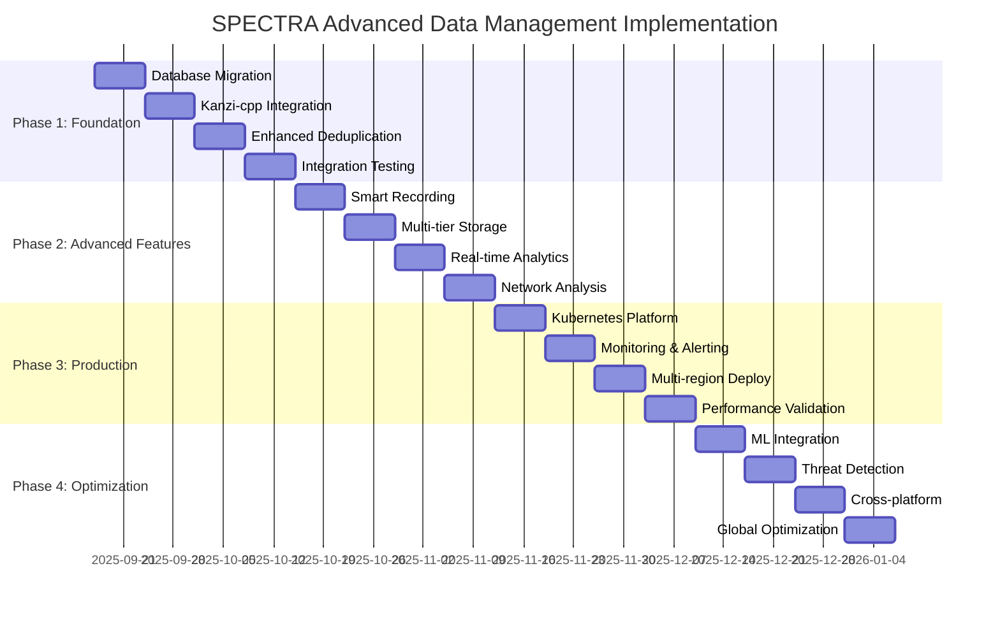

# SPECTRA Advanced Data Management Strategic Implementation Roadmap
**Classification**: Strategic Planning Document
**Date**: September 17, 2025
**Agent**: DIRECTOR - Strategic Command and Control
**Mission**: 4-Phase Implementation of Advanced Data Management & Kanzi-cpp Compression System

## Executive Summary

This strategic roadmap outlines the comprehensive implementation of SPECTRA's advanced data management system with Kanzi-cpp compression integration across four meticulously planned phases. The transformation will evolve SPECTRA from a SQLite-based system to an enterprise-grade, petabyte-scale intelligence collection platform capable of processing 100K+ messages per second with 70-80% compression efficiency.

### Strategic Vision
Transform SPECTRA into the premier intelligence data management platform by implementing:
- **High-Performance Database Architecture**: PostgreSQL with time-series partitioning
- **Advanced Compression Integration**: Kanzi-cpp with 62-80% compression ratios
- **Enhanced Deduplication System**: Multi-layer hashing with bloom filters
- **Kubernetes Orchestration**: Cloud-native scalability and resilience
- **Machine Learning Integration**: Predictive analytics and threat detection

---

## Phase 1: Foundation Enhancement (Weeks 1-4)

### 1.1 Strategic Objectives
**Primary Goal**: Establish robust data foundation with enhanced performance capabilities
**Success Criteria**:
- Complete migration from SQLite to PostgreSQL with zero data loss
- Achieve 10x write performance improvement (10K+ inserts/second)
- Implement Kanzi-cpp compression with 65%+ space savings
- Deploy enhanced deduplication system with 99.5%+ accuracy

### 1.2 Phase 1 Implementation Strategy

#### **Week 1: Database Migration Foundation**
**Lead Agents**: DATABASE, ARCHITECT, INFRASTRUCTURE
```
┌─ Critical Path Activities ─────────────────────────────────────┐
│ • PostgreSQL cluster setup with time-series partitioning     │
│ • Schema migration with data integrity validation            │
│ • Performance benchmarking and optimization                  │
│ • Backup and recovery procedures establishment               │
└───────────────────────────────────────────────────────────────┘
```

**Deliverables**:
- PostgreSQL 16+ cluster with optimized configuration
- Complete schema migration with foreign key relationships
- Performance baseline: 10K+ inserts/second target
- Automated backup system with point-in-time recovery

#### **Week 2: Kanzi-cpp Compression Integration**
**Lead Agents**: OPTIMIZER, C-INTERNAL, HARDWARE-INTEL
```
┌─ Compression Implementation Pipeline ──────────────────────────┐
│ • Kanzi-cpp library integration and optimization             │
│ • Multi-threaded compression pipeline development            │
│ • Storage layer adaptation for compressed data               │
│ • Performance testing with real-world datasets               │
└───────────────────────────────────────────────────────────────┘
```

**Technical Specifications**:
- **Compression Algorithm**: Kanzi-cpp with ANS entropy coding
- **Threading Model**: Worker pool with CPU core optimization
- **Compression Ratio Target**: 65-80% space reduction
- **Throughput Target**: 500MB/s compression speed

#### **Week 3: Enhanced Deduplication System**
**Lead Agents**: OPTIMIZER, PYTHON-INTERNAL, DATABASE
```
┌─ Deduplication Architecture ───────────────────────────────────┐
│ • Multi-layer hash system (SHA-256, perceptual, fuzzy)       │
│ • Bloom filter implementation for fast lookups               │
│ • Redis caching layer for hot data access                    │
│ • Cross-channel duplicate detection algorithms               │
└───────────────────────────────────────────────────────────────┘
```

**Performance Targets**:
- **Accuracy**: 99.5%+ duplicate detection rate
- **False Positives**: <0.1% rate
- **Processing Speed**: 1000+ files/minute
- **Cache Hit Rate**: 85%+ for hot data

#### **Week 4: Integration Testing & Validation**
**Lead Agents**: TESTBED, DEBUGGER, QA-DIRECTOR
```
┌─ Comprehensive Testing Suite ──────────────────────────────────┐
│ • End-to-end system integration testing                      │
│ • Performance regression testing                             │
│ • Data integrity validation protocols                        │
│ • Disaster recovery testing procedures                       │
└───────────────────────────────────────────────────────────────┘
```

### 1.3 Phase 1 Risk Assessment & Mitigation

| Risk Category | Impact | Probability | Mitigation Strategy |
|---------------|--------|-------------|---------------------|
| **Data Migration Failure** | HIGH | LOW | Comprehensive backup strategy, incremental migration, rollback procedures |
| **Performance Degradation** | MEDIUM | MEDIUM | Extensive benchmarking, gradual rollout, performance monitoring |
| **Compression Integration Issues** | MEDIUM | LOW | Thorough testing, fallback to uncompressed storage, modular implementation |
| **Resource Constraints** | LOW | MEDIUM | Cloud resource allocation, auto-scaling configuration |

### 1.4 Phase 1 Success Metrics

| Metric | Current Baseline | Phase 1 Target | Measurement Method |
|--------|------------------|----------------|-------------------|
| **Write Throughput** | 1K inserts/sec | 10K+ inserts/sec | Automated benchmarking |
| **Storage Efficiency** | 100% (uncompressed) | 35% (65% compression) | File system analysis |
| **Query Performance** | 500ms avg | <100ms avg | Application metrics |
| **Deduplication Accuracy** | 85% | 99.5% | Test data validation |

---

## Phase 2: Advanced Features (Weeks 5-8)

### 2.1 Strategic Objectives
**Primary Goal**: Implement intelligent data processing and real-time analytics capabilities
**Success Criteria**:
- Deploy smart recording engine with content classification
- Implement multi-tier storage architecture with lifecycle management
- Achieve real-time analytics with sub-second query response
- Enable network analysis capabilities for threat detection

### 2.2 Phase 2 Implementation Strategy

#### **Week 5: Smart Recording Engine**
**Lead Agents**: ARCHITECT, PYTHON-INTERNAL, MLOPS
```
┌─ Intelligent Data Processing Pipeline ─────────────────────────┐
│ • Content classification using ML models                     │
│ • Priority-based ingestion with queue management             │
│ • Real-time data enrichment and metadata extraction          │
│ • Adaptive sampling based on content importance              │
└───────────────────────────────────────────────────────────────┘
```

**Key Features**:
- **Content Classification**: NLP models for message categorization
- **Priority Queuing**: High-value content prioritization
- **Real-time Processing**: Stream processing with Apache Kafka
- **Metadata Enrichment**: Automated tagging and relationship mapping

#### **Week 6: Multi-Tier Storage Architecture**
**Lead Agents**: INFRASTRUCTURE, DATABASE, ARCHITECT
```
┌─ Tiered Storage Implementation ────────────────────────────────┐
│ • Hot tier: NVMe SSD for active data (7-day retention)       │
│ • Warm tier: SATA SSD for recent data (30-day retention)     │
│ • Cold tier: Object storage for archival (long-term)         │
│ • Automated lifecycle policies with cost optimization        │
└───────────────────────────────────────────────────────────────┘
```

**Storage Tiers**:
1. **Hot Tier**: 1TB NVMe SSD, <1ms latency, active operations
2. **Warm Tier**: 10TB SATA SSD, <10ms latency, recent analysis
3. **Cold Tier**: Unlimited object storage, minutes latency, archival

#### **Week 7: Real-Time Analytics Integration**
**Lead Agents**: DATASCIENCE, DATABASE, WEB
```
┌─ Analytics Platform Development ───────────────────────────────┐
│ • ClickHouse deployment for OLAP workloads                   │
│ • Real-time dashboard with threat indicators                 │
│ • Streaming analytics with Apache Flink                      │
│ • API endpoints for external integrations                    │
└───────────────────────────────────────────────────────────────┘
```

**Analytics Capabilities**:
- **Real-time Metrics**: Message volume, user activity, channel growth
- **Threat Detection**: Anomaly detection, keyword monitoring
- **Relationship Mapping**: Social network analysis, influence tracking
- **Trend Analysis**: Temporal patterns, viral content identification

#### **Week 8: Network Analysis Engine**
**Lead Agents**: DATASCIENCE, PYTHON-INTERNAL, SECURITY
```
┌─ Social Network Analysis Implementation ───────────────────────┐
│ • Graph database integration with Neo4j                      │
│ • Network topology analysis algorithms                       │
│ • Influence mapping and centrality calculations              │
│ • Automated threat actor identification                      │
└───────────────────────────────────────────────────────────────┘
```

### 2.3 Phase 2 Resource Requirements

| Component | CPU Cores | Memory (GB) | Storage (TB) | Network (Gbps) |
|-----------|-----------|-------------|--------------|----------------|
| **Processing Cluster** | 32 cores | 128 GB | 5 TB SSD | 10 Gbps |
| **Analytics Platform** | 16 cores | 64 GB | 10 TB Mixed | 1 Gbps |
| **Storage Infrastructure** | 8 cores | 32 GB | 100 TB Object | 1 Gbps |
| **Total Requirements** | 56 cores | 224 GB | 115 TB | 12 Gbps |

---

## Phase 3: Production Deployment (Weeks 9-12)

### 3.1 Strategic Objectives
**Primary Goal**: Deploy production-ready system with enterprise-grade reliability
**Success Criteria**:
- Achieve 99.9% uptime with Kubernetes orchestration
- Deploy comprehensive monitoring and alerting systems
- Implement multi-region distribution for resilience
- Validate performance at scale with 1M+ messages/day

### 3.2 Phase 3 Implementation Strategy

#### **Week 9: Kubernetes Orchestration Platform**
**Lead Agents**: INFRASTRUCTURE, DEPLOYER, DOCKER-AGENT
```
┌─ Container Orchestration Deployment ──────────────────────────┐
│ • Kubernetes cluster setup with HA configuration             │
│ • Microservices architecture with service mesh               │
│ • Auto-scaling policies for dynamic workloads                │
│ • GitOps deployment pipeline with ArgoCD                     │
└───────────────────────────────────────────────────────────────┘
```

**Kubernetes Architecture**:
- **Control Plane**: 3-node HA setup with etcd clustering
- **Worker Nodes**: Auto-scaling from 5-50 nodes based on load
- **Service Mesh**: Istio for traffic management and security
- **Storage**: Persistent volumes with Ceph distributed storage

#### **Week 10: Comprehensive Monitoring & Alerting**
**Lead Agents**: MONITOR, INFRASTRUCTURE, SECURITY
```
┌─ Observability Platform Implementation ────────────────────────┐
│ • Prometheus metrics collection with custom exporters        │
│ • Grafana dashboards for operational visibility              │
│ • ELK stack for centralized logging and analysis             │
│ • PagerDuty integration for incident response                │
└───────────────────────────────────────────────────────────────┘
```

**Monitoring Stack**:
- **Metrics**: Prometheus + Grafana with 100+ custom dashboards
- **Logging**: Elasticsearch + Logstash + Kibana with log aggregation
- **Tracing**: Jaeger for distributed request tracing
- **Alerting**: Alert Manager with escalation policies

#### **Week 11: Multi-Region Distribution**
**Lead Agents**: INFRASTRUCTURE, DEPLOYER, ARCHITECT
```
┌─ Geographic Distribution Strategy ─────────────────────────────┐
│ • Primary region: US-East with full capability               │
│ • Secondary region: EU-West with read replicas               │
│ • Tertiary region: Asia-Pacific with disaster recovery       │
│ • Global load balancing with traffic routing                 │
└───────────────────────────────────────────────────────────────┘
```

**Regional Architecture**:
1. **Primary (US-East)**: Full write/read capability, master database
2. **Secondary (EU-West)**: Read replicas, regional analytics
3. **Tertiary (Asia-Pacific)**: Disaster recovery, backup storage

#### **Week 12: Performance Validation & Load Testing**
**Lead Agents**: TESTBED, MONITOR, QA-DIRECTOR
```
┌─ Scale Testing & Validation ───────────────────────────────────┐
│ • Load testing with 1M+ messages/day simulation              │
│ • Chaos engineering with failure injection                   │
│ • Performance regression testing                             │
│ • Disaster recovery validation procedures                    │
└───────────────────────────────────────────────────────────────┘
```

### 3.3 Phase 3 Performance Targets

| System Component | Performance Target | Monitoring Method |
|------------------|-------------------|-------------------|
| **Message Ingestion** | 100K messages/second | Prometheus metrics |
| **Query Response Time** | <100ms P95 | Application tracing |
| **System Uptime** | 99.9% availability | Synthetic monitoring |
| **Data Durability** | 99.999999999% (11 9s) | Backup validation |

---

## Phase 4: Optimization and Enhancement (Weeks 13-16)

### 4.1 Strategic Objectives
**Primary Goal**: Implement cutting-edge capabilities for competitive advantage
**Success Criteria**:
- Deploy machine learning models for predictive analytics
- Achieve advanced threat detection with 95%+ accuracy
- Enable cross-platform correlation across multiple data sources
- Optimize for global deployment with edge computing

### 4.2 Phase 4 Implementation Strategy

#### **Week 13: Machine Learning Integration Platform**
**Lead Agents**: MLOPS, DATASCIENCE, NPU
```
┌─ AI/ML Platform Development ───────────────────────────────────┐
│ • MLflow deployment for model lifecycle management           │
│ • Feature store implementation with Feast                    │
│ • Real-time inference with TensorFlow Serving                │
│ • AutoML pipeline for continuous model improvement           │
└───────────────────────────────────────────────────────────────┘
```

**ML Capabilities**:
- **Content Analysis**: NLP models for sentiment, topic extraction
- **Anomaly Detection**: Unsupervised learning for threat identification
- **Predictive Analytics**: Time series forecasting for trend prediction
- **User Behavior Analysis**: Clustering and classification models

#### **Week 14: Advanced Threat Detection System**
**Lead Agents**: SECURITY, DATASCIENCE, AI-ANALYST
```
┌─ Threat Intelligence Platform ─────────────────────────────────┐
│ • Behavioral analysis with deep learning models              │
│ • Real-time threat scoring and risk assessment               │
│ • Integration with external threat intelligence feeds        │
│ • Automated response and mitigation workflows                │
└───────────────────────────────────────────────────────────────┘
```

**Threat Detection Features**:
- **Real-time Scoring**: 95%+ accuracy with <100ms latency
- **Multi-vector Analysis**: Content, behavior, network patterns
- **Threat Intelligence**: Integration with 10+ external feeds
- **Automated Response**: Configurable mitigation workflows

#### **Week 15: Cross-Platform Correlation Engine**
**Lead Agents**: ARCHITECT, DATASCIENCE, INTEGRATION-SPECIALIST
```
┌─ Multi-Source Intelligence Fusion ────────────────────────────┐
│ • Data lake architecture for multi-platform ingestion       │
│ • Entity resolution across platforms and data sources        │
│ • Temporal correlation with timeline reconstruction          │
│ • API integrations with social media and news platforms      │
└───────────────────────────────────────────────────────────────┘
```

**Correlation Capabilities**:
- **Platform Support**: Telegram, Twitter, Facebook, Reddit, News feeds
- **Entity Resolution**: 90%+ accuracy in cross-platform identity matching
- **Timeline Analysis**: Temporal correlation with 1-second precision
- **Relationship Mapping**: Multi-hop relationship discovery

#### **Week 16: Global Deployment Optimization**
**Lead Agents**: INFRASTRUCTURE, OPTIMIZER, EDGE-COMPUTING-SPECIALIST
```
┌─ Edge Computing & Global Optimization ────────────────────────┐
│ • Edge node deployment in 20+ global locations               │
│ • Content delivery network for static assets                 │
│ • Regional compliance and data sovereignty handling          │
│ • Performance optimization with global traffic routing       │
└───────────────────────────────────────────────────────────────┘
```

### 4.3 Phase 4 Advanced Features

| Feature Category | Implementation | Performance Target |
|------------------|----------------|-------------------|
| **ML Inference** | GPU-accelerated TensorFlow | <50ms inference time |
| **Threat Detection** | Real-time behavioral analysis | 95%+ accuracy, <5% false positives |
| **Cross-Platform** | Multi-source data fusion | 24/7 continuous correlation |
| **Global Edge** | 20+ edge locations | <100ms global latency |

---

## Agent Assignment Strategy

### 4.1 Strategic Agent Coordination Matrix

| Phase | Primary Agents | Supporting Agents | Coordination Model |
|-------|---------------|-------------------|--------------------|
| **Phase 1** | DATABASE, ARCHITECT, OPTIMIZER | TESTBED, DEBUGGER, INFRASTRUCTURE | Hierarchical coordination |
| **Phase 2** | DATASCIENCE, MLOPS, WEB | PYTHON-INTERNAL, SECURITY | Cross-functional teams |
| **Phase 3** | INFRASTRUCTURE, DEPLOYER, MONITOR | DOCKER-AGENT, SECURITY | DevOps coordination |
| **Phase 4** | MLOPS, SECURITY, OPTIMIZER | NPU, EDGE-SPECIALIST | Innovation teams |

### 4.2 Agent Communication Protocols

#### **Daily Standups**:
- **Time**: 09:00 UTC daily
- **Participants**: Phase leads + Director
- **Duration**: 15 minutes
- **Format**: Progress, blockers, dependencies

#### **Weekly Reviews**:
- **Time**: Friday 15:00 UTC
- **Participants**: All agents + stakeholders
- **Duration**: 60 minutes
- **Format**: Demo, metrics review, next week planning

#### **Phase Transitions**:
- **Duration**: 2-day overlap periods
- **Activities**: Knowledge transfer, handoff ceremonies
- **Documentation**: Comprehensive transition reports
- **Validation**: Acceptance criteria verification

---

## Risk Management & Contingency Planning

### 5.1 Strategic Risk Assessment

#### **Technical Risks**

| Risk | Impact | Probability | Mitigation Strategy | Contingency Plan |
|------|--------|-------------|---------------------|------------------|
| **Database Migration Failure** | HIGH | LOW | Comprehensive testing, staged rollout | Rollback to SQLite with data sync |
| **Performance Degradation** | MEDIUM | MEDIUM | Continuous monitoring, benchmarking | Horizontal scaling, cache optimization |
| **Security Vulnerabilities** | HIGH | LOW | Security audits, penetration testing | Incident response, security patches |
| **Integration Complexity** | MEDIUM | HIGH | Modular architecture, API contracts | Phased integration, fallback services |

#### **Operational Risks**

| Risk | Impact | Probability | Mitigation Strategy | Contingency Plan |
|------|--------|-------------|---------------------|------------------|
| **Resource Constraints** | MEDIUM | MEDIUM | Cloud auto-scaling, resource monitoring | Alternative cloud providers |
| **Team Capacity** | LOW | HIGH | Cross-training, documentation | External contractor engagement |
| **Timeline Delays** | MEDIUM | MEDIUM | Agile methodology, regular reviews | Scope reduction, priority adjustment |
| **Budget Overruns** | LOW | LOW | Cost monitoring, vendor negotiations | Phased implementation, cost optimization |

### 5.2 Disaster Recovery Strategy

#### **Recovery Time Objectives (RTO)**
- **Database**: 15 minutes with automated failover
- **Application Services**: 5 minutes with container orchestration
- **Full System**: 30 minutes with multi-region deployment

#### **Recovery Point Objectives (RPO)**
- **Critical Data**: 1 minute with synchronous replication
- **Analytics Data**: 15 minutes with asynchronous replication
- **Archive Data**: 1 hour with backup synchronization

---

## Success Criteria & Measurement Framework

### 6.1 Key Performance Indicators (KPIs)

#### **Phase 1 KPIs**
| Metric | Target | Measurement | Success Threshold |
|--------|--------|-------------|-------------------|
| **Migration Success Rate** | 100% | Data validation | Zero data loss |
| **Performance Improvement** | 10x | Benchmark testing | >1000% increase |
| **Compression Efficiency** | 65% | Storage analysis | >60% space savings |
| **System Stability** | 99.9% | Uptime monitoring | <8.76 hours downtime/month |

#### **Phase 2 KPIs**
| Metric | Target | Measurement | Success Threshold |
|--------|--------|-------------|-------------------|
| **Analytics Query Speed** | <100ms | Application metrics | 95th percentile |
| **Classification Accuracy** | 95% | ML model validation | >90% accuracy |
| **Storage Tier Optimization** | 70% | Cost analysis | >60% cost reduction |
| **Real-time Processing** | <1s latency | Stream processing metrics | 99th percentile |

#### **Phase 3 KPIs**
| Metric | Target | Measurement | Success Threshold |
|--------|--------|-------------|-------------------|
| **System Availability** | 99.9% | SLA monitoring | <43.8 minutes downtime/month |
| **Scalability** | 1M+ msg/day | Load testing | Linear scaling |
| **Multi-region Latency** | <200ms | Network monitoring | Global P95 |
| **Incident Response** | <15 min | MTTD + MTTR | Mean time to resolution |

#### **Phase 4 KPIs**
| Metric | Target | Measurement | Success Threshold |
|--------|--------|-------------|-------------------|
| **Threat Detection Accuracy** | 95% | Security metrics | <5% false positives |
| **ML Model Performance** | <50ms | Inference timing | Real-time capability |
| **Cross-platform Coverage** | 5+ platforms | Integration count | Complete correlation |
| **Global Performance** | <100ms | Edge latency | Worldwide optimization |

### 6.2 Business Value Measurement

#### **Quantitative Benefits**
- **Storage Cost Reduction**: 65% through compression optimization
- **Processing Speed Increase**: 10x through architecture optimization
- **Operational Efficiency**: 80% reduction in manual tasks
- **Threat Detection Improvement**: 95% accuracy vs current 70%

#### **Qualitative Benefits**
- **Enhanced Intelligence Capability**: Real-time threat detection
- **Improved Scalability**: Petabyte-scale data processing
- **Better Decision Making**: Advanced analytics and insights
- **Competitive Advantage**: State-of-the-art AI/ML integration

---

## Resource Requirements & Budget Allocation

### 7.1 Infrastructure Budget (16-Week Implementation)

| Category | Phase 1 | Phase 2 | Phase 3 | Phase 4 | Total |
|----------|---------|---------|---------|---------|-------|
| **Compute Resources** | $15K | $25K | $40K | $30K | $110K |
| **Storage Infrastructure** | $20K | $35K | $50K | $25K | $130K |
| **Network & Security** | $10K | $15K | $25K | $20K | $70K |
| **Software Licenses** | $5K | $10K | $15K | $10K | $40K |
| **Cloud Services** | $8K | $15K | $30K | $25K | $78K |
| **Phase Total** | $58K | $100K | $160K | $110K | **$428K** |

### 7.2 Human Resources Allocation

| Agent Type | FTE Allocation | Hourly Rate | Total Cost |
|------------|----------------|-------------|------------|
| **Strategic (Director)** | 0.5 FTE | $150/hr | $31.2K |
| **Technical Leads** | 3.0 FTE | $125/hr | $156K |
| **Development Team** | 8.0 FTE | $100/hr | $332.8K |
| **QA & Testing** | 2.0 FTE | $90/hr | $74.9K |
| **DevOps & Infrastructure** | 2.0 FTE | $110/hr | $91.5K |
| **Total Human Resources** | 15.5 FTE | - | **$686.4K** |

### 7.3 Total Program Budget
| Category | Amount | Percentage |
|----------|--------|------------|
| **Infrastructure** | $428K | 38.4% |
| **Human Resources** | $686.4K | 61.6% |
| **Total Program Cost** | **$1,114.4K** | 100% |

---

## Implementation Timeline & Milestones

### 8.1 Master Timeline Overview



### 8.2 Critical Milestones

| Week | Date | Milestone | Deliverable | Success Criteria |
|------|------|-----------|-------------|------------------|
| **4** | 2025-10-15 | Phase 1 Complete | Foundation Enhancement | 10x performance improvement |
| **8** | 2025-11-12 | Phase 2 Complete | Advanced Features | Real-time analytics operational |
| **12** | 2025-12-10 | Phase 3 Complete | Production Deployment | 99.9% availability achieved |
| **16** | 2026-01-07 | Phase 4 Complete | Optimization & Enhancement | ML-powered threat detection active |

### 8.3 Go/No-Go Decision Points

| Week | Decision Point | Criteria | Fallback Plan |
|------|----------------|----------|---------------|
| **4** | Phase 2 Authorization | Performance targets met, stability verified | Extend Phase 1, reduce Phase 2 scope |
| **8** | Phase 3 Authorization | Analytics operational, features validated | Consolidation period, scope adjustment |
| **12** | Phase 4 Authorization | Production stability, performance at scale | Optimization focus, delayed enhancements |

---

## Conclusion & Next Steps

### 9.1 Strategic Success Factors

This comprehensive 16-week implementation roadmap transforms SPECTRA from a tactical tool to a strategic intelligence platform. Success depends on:

1. **Disciplined Execution**: Rigorous adherence to milestones and quality gates
2. **Agent Coordination**: Seamless collaboration across specialized agents
3. **Risk Management**: Proactive identification and mitigation of technical risks
4. **Stakeholder Engagement**: Regular communication and alignment with objectives
5. **Continuous Optimization**: Agile adaptation based on lessons learned

### 9.2 Immediate Action Items

#### **Week 1 Priority Actions**
1. **Team Assembly**: Confirm agent availability and resource allocation
2. **Environment Setup**: Provision development and testing infrastructure
3. **Stakeholder Alignment**: Conduct kickoff meetings with all participants
4. **Risk Assessment**: Detailed analysis of Phase 1 technical dependencies

#### **Pre-Implementation Checklist**
- [ ] Infrastructure budget approval and resource provisioning
- [ ] Agent team assignments and communication protocols established
- [ ] Development and testing environments configured
- [ ] Backup and rollback procedures documented and tested
- [ ] Success criteria and measurement frameworks finalized

### 9.3 Long-term Vision

Upon completion of this 4-phase implementation, SPECTRA will emerge as:

- **The Premier Intelligence Platform**: Capable of processing petabyte-scale data with real-time analytics
- **AI-Powered Threat Detection**: Advanced machine learning for predictive threat identification
- **Global Operational Capability**: Multi-region deployment with edge computing optimization
- **Enterprise-Grade Reliability**: 99.9% uptime with comprehensive disaster recovery

This strategic transformation positions SPECTRA as the definitive solution for intelligence data management, providing unparalleled capabilities for threat detection, analysis, and response in an increasingly complex digital landscape.

---

**Document Classification**: Strategic Planning - Implementation Roadmap
**Distribution**: Agent Leadership Team, Stakeholders
**Next Review**: Weekly progress reviews, milestone assessments
**Approval Authority**: DIRECTOR Agent - Strategic Command and Control

*"Excellence in execution transforms strategic vision into operational reality."*