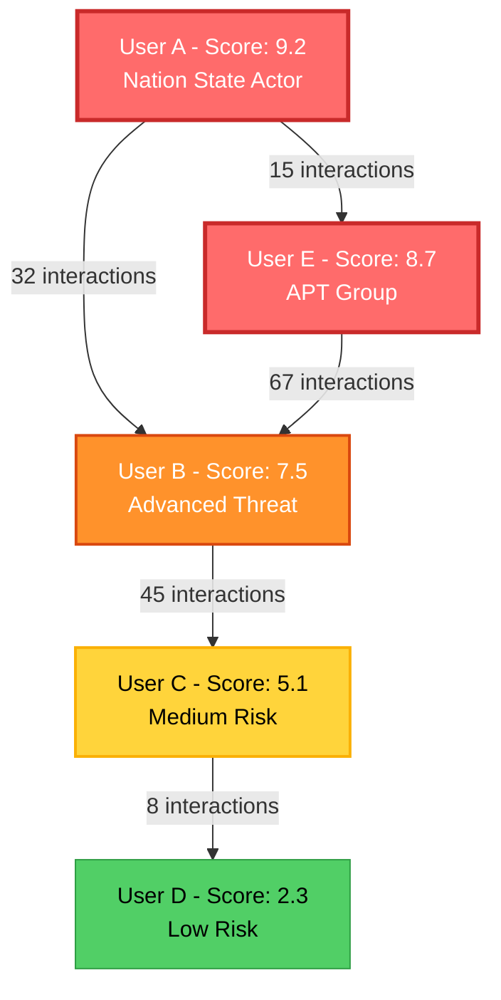
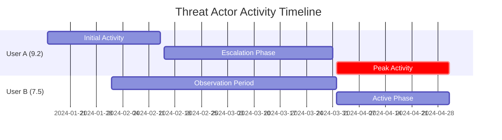
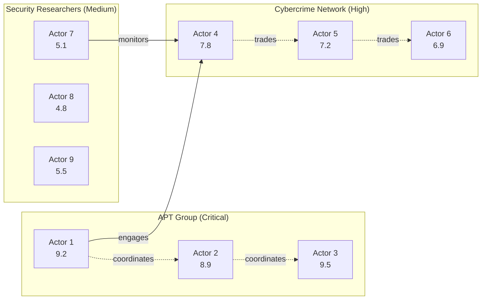

# SPECTRA Advanced Threat Scoring System - Comprehensive Plan

**Version:** 1.0
**Status:** Design & Implementation
**Purpose:** Automated threat actor identification and network analysis

---

## Executive Summary

This document outlines the design and implementation of an advanced threat scoring system for SPECTRA that automatically identifies, scores, and tracks potential threat actors based on their communications, behaviors, and network associations.

### Key Objectives

1. **Automated Threat Detection**: Identify discussions of sensitive topics (cybersecurity, exploits, nation-state activities)
2. **Actor Scoring**: Assign threat scores 1-10 to individuals based on indicators
3. **Network Mapping**: Track interactions and establish threat networks
4. **Visual Intelligence**: Generate easy-to-read visualizations (Mermaid, network graphs)
5. **Real-time Monitoring**: Continuously update scores and networks as new data arrives

---

## Threat Scoring Scale (1-10)

| Score | Classification | Description | Indicators |
|-------|---------------|-------------|------------|
| **1-2** | **Harmless** | General public, no threat indicators | Normal conversation, no sensitive topics |
| **3-4** | **Low Risk** | Casual interest in security topics | Basic security discussions, learning |
| **5-6** | **Medium Risk** | Active security researchers, grey-hat | Technical discussions, vulnerability research |
| **7-8** | **High Risk** | Advanced threat actors, cybercriminals | Exploit trading, malware discussion, reconnaissance |
| **9-10** | **Critical Risk** | Nation-state actors, APT groups | Advanced persistent threats, state-sponsored indicators |

---

## System Architecture

```
┌─────────────────────────────────────────────────────────────────┐
│              SPECTRA Threat Scoring System                      │
├─────────────────────────────────────────────────────────────────┤
│                                                                  │
│  ┌──────────────────────────────────────────────────────────┐  │
│  │           Data Ingestion Layer                            │  │
│  │  • Telegram Messages  • User Metadata  • Media Files     │  │
│  └──────────────────┬───────────────────────────────────────┘  │
│                     │                                           │
│  ┌──────────────────▼───────────────────────────────────────┐  │
│  │        Threat Indicator Detection Engine                  │  │
│  │  ┌────────────┐ ┌────────────┐ ┌────────────┐           │  │
│  │  │ Keyword    │ │ Pattern    │ │ Behavioral │           │  │
│  │  │ Detection  │ │ Matching   │ │ Analysis   │           │  │
│  │  └────────────┘ └────────────┘ └────────────┘           │  │
│  └──────────────────┬───────────────────────────────────────┘  │
│                     │                                           │
│  ┌──────────────────▼───────────────────────────────────────┐  │
│  │           Actor Profiling & Scoring                       │  │
│  │  • Threat Score Calculation (1-10)                        │  │
│  │  • Indicator Aggregation                                  │  │
│  │  • Confidence Scoring                                     │  │
│  │  • Temporal Pattern Analysis                              │  │
│  └──────────────────┬───────────────────────────────────────┘  │
│                     │                                           │
│  ┌──────────────────▼───────────────────────────────────────┐  │
│  │        Network Relationship Tracker                       │  │
│  │  • Interaction Graph                                      │  │
│  │  • Association Scoring                                    │  │
│  │  • Community Detection                                    │  │
│  │  • Contagion Analysis (threat spread)                     │  │
│  └──────────────────┬───────────────────────────────────────┘  │
│                     │                                           │
│  ┌──────────────────▼───────────────────────────────────────┐  │
│  │        Visualization & Intelligence Output                │  │
│  │  • Mermaid Diagrams  • Network Graphs                     │  │
│  │  • Threat Reports    • Actor Profiles                     │  │
│  │  • Alert Generation  • Export (PDF, JSON, HTML)           │  │
│  └──────────────────────────────────────────────────────────┘  │
│                                                                  │
└─────────────────────────────────────────────────────────────────┘
```

---

## Component 1: Threat Indicator Detection Engine

### 1.1 Keyword-Based Detection

**High-Severity Keywords** (Score Impact: +3 to +5)
```python
CRITICAL_KEYWORDS = {
    # Exploit & Vulnerability
    "zero-day", "0day", "exploit kit", "RCE", "remote code execution",
    "privilege escalation", "CVE-2024", "weaponized exploit",

    # Malware & Tools
    "ransomware", "backdoor", "trojan", "rootkit", "botnet", "C2 server",
    "command and control", "RAT", "remote access trojan",

    # Nation-State Indicators
    "APT28", "APT29", "Lazarus Group", "Sandworm", "Equation Group",
    "state-sponsored", "nation-state", "geopolitical cyber",

    # Infrastructure
    "tor hidden service", "darknet market", "bulletproof hosting",
    "anonymous infrastructure", "covert channel",

    # Operations
    "cyber warfare", "information operations", "psyops", "disinformation campaign",
    "targeted attack", "spear phishing", "watering hole",
}
```

**Medium-Severity Keywords** (Score Impact: +1 to +2)
```python
MODERATE_KEYWORDS = {
    # Security Research
    "vulnerability research", "penetration testing", "security audit",
    "red team", "blue team", "capture the flag", "CTF",

    # Technical Topics
    "buffer overflow", "SQL injection", "XSS", "CSRF",
    "cryptography", "encryption", "reverse engineering",

    # Tools (legitimate use possible)
    "metasploit", "burp suite", "nmap", "wireshark", "kali linux",
    "ghidra", "IDA Pro", "volatility",
}
```

**Low-Severity Keywords** (Score Impact: +0.5)
```python
LOW_KEYWORDS = {
    # General Security
    "cybersecurity", "information security", "infosec",
    "bug bounty", "responsible disclosure", "security patch",
    "firewall", "antivirus", "security awareness",
}
```

### 1.2 Pattern-Based Detection

**Regex Patterns for Threat Indicators**

1. **CVE References**
   - Pattern: `CVE-\d{4}-\d{4,7}`
   - Score Impact: +1 to +3 (depending on recency and severity)

2. **IP Addresses & Infrastructure**
   - Pattern: `\b(?:\d{1,3}\.){3}\d{1,3}\b` (IP addresses)
   - Context analysis: Is it malicious infrastructure?
   - Score Impact: +2 if matched against threat feeds

3. **Malware Hashes**
   - Pattern: `\b[a-f0-9]{32,64}\b` (MD5, SHA256)
   - Cross-reference with VirusTotal/threat feeds
   - Score Impact: +3 to +5 if confirmed malicious

4. **Crypto Addresses** (for ransom/payment tracking)
   - Bitcoin: `\b[13][a-km-zA-HJ-NP-Z1-9]{25,34}\b`
   - Ethereum: `\b0x[a-fA-F0-9]{40}\b`
   - Monero: `\b4[0-9AB][1-9A-HJ-NP-Za-km-z]{93}\b`
   - Score Impact: +2 if in ransomware context

5. **Onion Addresses** (Tor hidden services)
   - Pattern: `\b[a-z2-7]{16,56}\.onion\b`
   - Score Impact: +2 to +4 (darknet markets, C2)

6. **Credentials/Leaks**
   - Pattern: `password\s*[:=]\s*\S+` (leaked credentials)
   - Pattern: `login\s*[:=].*password\s*[:=]`
   - Score Impact: +3 (data breach involvement)

### 1.3 Behavioral Analysis

**Behavioral Threat Indicators**

1. **Activity Patterns**
   - Posting frequency spikes (sudden increase)
   - Unusual posting hours (OPSEC indicators)
   - Message deletion patterns (anti-forensics)
   - Score Impact: +1 to +2

2. **Communication Patterns**
   - Encrypted communication mentions (PGP, OTR, Signal)
   - Operational security discussions (OPSEC, COMSEC)
   - Dead drop references, covert channels
   - Score Impact: +2 to +3

3. **Technical Sophistication**
   - Advanced technical discussions
   - Code snippets (exploits, malware)
   - Technical depth and accuracy
   - Score Impact: +1 to +3

4. **Network Associations**
   - Interactions with known threat actors
   - Membership in high-risk channels
   - Cross-platform presence (coordinated)
   - Score Impact: +2 to +5 (guilt by association)

---

## Component 2: Actor Profiling & Scoring

### 2.1 Threat Score Calculation Algorithm

```python
def calculate_threat_score(actor_profile):
    """
    Calculate comprehensive threat score (1-10 scale)

    Scoring Factors:
    1. Keyword indicators (30% weight)
    2. Pattern matches (25% weight)
    3. Behavioral analysis (20% weight)
    4. Network associations (15% weight)
    5. Temporal patterns (10% weight)
    """

    # Base score
    base_score = 1.0

    # Factor 1: Keyword indicators
    keyword_score = sum([
        indicator.score for indicator in actor_profile.keyword_indicators
    ]) / len(actor_profile.messages) if actor_profile.messages else 0

    # Factor 2: Pattern matches
    pattern_score = sum([
        match.severity for match in actor_profile.pattern_matches
    ]) / max(len(actor_profile.messages), 1)

    # Factor 3: Behavioral analysis
    behavioral_score = calculate_behavioral_score(actor_profile)

    # Factor 4: Network associations
    network_score = calculate_network_association_score(actor_profile)

    # Factor 5: Temporal patterns
    temporal_score = analyze_temporal_patterns(actor_profile)

    # Weighted sum
    total_score = (
        keyword_score * 0.30 +
        pattern_score * 0.25 +
        behavioral_score * 0.20 +
        network_score * 0.15 +
        temporal_score * 0.10
    )

    # Normalize to 1-10 scale
    final_score = min(10.0, max(1.0, base_score + total_score))

    return final_score
```

### 2.2 Confidence Scoring

Each threat score has an associated confidence level:

- **High Confidence (80-100%)**: Multiple indicators, verified patterns
- **Medium Confidence (50-79%)**: Some indicators, patterns present
- **Low Confidence (0-49%)**: Few indicators, ambiguous patterns

```python
confidence = (
    (num_indicators / 10) * 0.4 +
    (num_verified_patterns / 5) * 0.3 +
    (message_count / 100) * 0.2 +
    (time_span_days / 365) * 0.1
)
```

### 2.3 Actor Profile Structure

```python
@dataclass
class ThreatActorProfile:
    user_id: int
    username: str
    threat_score: float  # 1-10
    confidence: float    # 0-1
    classification: str  # "Harmless", "Low Risk", "Medium Risk", etc.

    # Indicators
    keyword_indicators: List[KeywordIndicator]
    pattern_matches: List[PatternMatch]
    behavioral_flags: List[BehaviorFlag]

    # Activity
    first_seen: datetime
    last_seen: datetime
    message_count: int
    channels: List[int]

    # Network
    associates: List[int]  # User IDs of contacts
    network_score: float   # Association threat score

    # Metadata
    tags: List[str]  # e.g., ["APT", "Cybercriminal", "Researcher"]
    notes: str
    last_updated: datetime
```

---

## Component 3: Network Relationship Tracker

### 3.1 Interaction Types

**Weighted Interaction Scores**

| Interaction Type | Weight | Description |
|-----------------|--------|-------------|
| Direct Reply | 1.0 | Direct response to message |
| Mention | 0.8 | @username mention |
| Same Thread | 0.6 | Posting in same conversation |
| Same Channel | 0.3 | Both active in channel |
| Forwarded Content | 0.9 | Forwarding each other's messages |
| Media Sharing | 0.7 | Sharing media/files |

### 3.2 Network Metrics

**Graph Analysis Metrics**

1. **Centrality Measures**
   - **Degree Centrality**: Number of direct connections
   - **Betweenness Centrality**: Bridge between groups (key communicator)
   - **Eigenvector Centrality**: Connected to other important nodes
   - **PageRank**: Overall influence in network

2. **Community Detection**
   - **Louvain Algorithm**: Identify threat clusters
   - **Label Propagation**: Community membership
   - **Modularity**: Strength of community structure

3. **Threat Contagion**
   - **Association Score**: Average threat score of connections
   - **Threat Spread**: How threat scores propagate through network
   - **Isolation Score**: How isolated from benign actors

### 3.3 Network Association Scoring

```python
def calculate_network_association_score(actor_profile, network_graph):
    """
    Calculate threat score based on network associations.
    "You are who you associate with" principle.
    """

    # Get direct connections
    connections = network_graph.neighbors(actor_profile.user_id)

    if not connections:
        return 0.0

    # Calculate weighted average of connection threat scores
    total_weighted_score = 0
    total_weight = 0

    for connection_id in connections:
        connection = get_actor_profile(connection_id)
        edge_data = network_graph.get_edge_data(actor_profile.user_id, connection_id)

        interaction_weight = edge_data.get('weight', 1.0)
        connection_threat = connection.threat_score

        total_weighted_score += connection_threat * interaction_weight
        total_weight += interaction_weight

    # Average association score
    avg_association_score = total_weighted_score / total_weight

    # Boost factor for high-threat associations
    high_threat_connections = [
        c for c in connections
        if get_actor_profile(c).threat_score >= 7.0
    ]

    boost = len(high_threat_connections) * 0.5

    return min(5.0, avg_association_score + boost)
```

---

## Component 4: Visualization & Output

### 4.1 Mermaid Diagram Generation

**Network Graph (Mermaid)**



**Threat Score Timeline (Mermaid)**



**Community Structure (Mermaid)**



### 4.2 Threat Intelligence Report Format

```markdown
# THREAT INTELLIGENCE REPORT
**Generated:** 2025-01-15 14:30:00 UTC
**Report ID:** TIR-2025-0115-001

## Executive Summary

- **Total Actors Monitored:** 1,234
- **Critical Threat Actors (9-10):** 23 (1.9%)
- **High Threat Actors (7-8):** 87 (7.0%)
- **Active Threat Networks:** 5 identified clusters

## Top Threat Actors

### 1. User_ID_12345 (Score: 9.5, Confidence: 92%)
**Classification:** Nation-State Actor (APT29 indicators)

**Indicators:**
- 45 critical keyword matches (zero-day, APT29, Cozy Bear)
- 12 CVE references (including 3 zero-days)
- 8 malicious hash references (confirmed via VirusTotal)
- High technical sophistication

**Network:**
- Direct connections: 23 (avg threat score: 7.8)
- Community: APT_CLUSTER_01 (15 members)
- Centrality rank: #1 (highest influence)

**Activity:**
- First seen: 2024-06-12
- Last seen: 2025-01-15
- Message count: 234
- Active channels: 8

**Recommended Action:** MONITOR - High Priority Intelligence Target

---

### 2. User_ID_67890 (Score: 8.7, Confidence: 85%)
...
```

### 4.3 Real-Time Alerting

**Alert Levels**

| Level | Trigger | Action |
|-------|---------|--------|
| **CRITICAL** | Score ≥ 9.0 or nation-state indicators | Immediate analyst notification |
| **HIGH** | Score 7.0-8.9 or verified exploit discussion | Priority queue for review |
| **MEDIUM** | Score 5.0-6.9 or suspicious patterns | Automated monitoring |
| **LOW** | Score 3.0-4.9 | Background tracking |

**Alert Format (JSON)**

```json
{
  "alert_id": "ALERT-2025-0115-001",
  "timestamp": "2025-01-15T14:30:00Z",
  "level": "CRITICAL",
  "actor": {
    "user_id": 12345,
    "username": "user_example",
    "threat_score": 9.5,
    "confidence": 0.92,
    "classification": "Nation-State Actor"
  },
  "trigger": {
    "type": "keyword_match",
    "indicator": "APT29",
    "context": "Discussion of zero-day exploit targeting...",
    "message_id": 98765
  },
  "recommended_action": "Immediate analyst review",
  "related_actors": [67890, 54321, 11111]
}
```

---

## Component 5: Integration with Existing SPECTRA Features

### 5.1 Database Schema Extensions

**New Tables**

```sql
-- Threat Actor Profiles
CREATE TABLE threat_actors (
    user_id INTEGER PRIMARY KEY,
    username TEXT,
    threat_score REAL,
    confidence REAL,
    classification TEXT,
    first_seen TEXT,
    last_seen TEXT,
    message_count INTEGER,
    last_updated TEXT,
    metadata TEXT  -- JSON blob
);

-- Threat Indicators
CREATE TABLE threat_indicators (
    id INTEGER PRIMARY KEY AUTOINCREMENT,
    user_id INTEGER,
    message_id INTEGER,
    indicator_type TEXT,  -- 'keyword', 'pattern', 'behavioral'
    indicator_value TEXT,
    severity REAL,
    timestamp TEXT,
    FOREIGN KEY (user_id) REFERENCES threat_actors(user_id),
    FOREIGN KEY (message_id) REFERENCES messages(id)
);

-- Network Relationships
CREATE TABLE actor_relationships (
    id INTEGER PRIMARY KEY AUTOINCREMENT,
    source_user_id INTEGER,
    target_user_id INTEGER,
    interaction_type TEXT,
    interaction_count INTEGER,
    weight REAL,
    first_interaction TEXT,
    last_interaction TEXT,
    FOREIGN KEY (source_user_id) REFERENCES threat_actors(user_id),
    FOREIGN KEY (target_user_id) REFERENCES threat_actors(user_id)
);

-- Threat Clusters
CREATE TABLE threat_clusters (
    cluster_id INTEGER PRIMARY KEY AUTOINCREMENT,
    cluster_name TEXT,
    avg_threat_score REAL,
    member_count INTEGER,
    description TEXT,
    created_at TEXT
);

-- Cluster Memberships
CREATE TABLE cluster_memberships (
    user_id INTEGER,
    cluster_id INTEGER,
    membership_strength REAL,
    PRIMARY KEY (user_id, cluster_id),
    FOREIGN KEY (user_id) REFERENCES threat_actors(user_id),
    FOREIGN KEY (cluster_id) REFERENCES threat_clusters(cluster_id)
);

-- Threat Alerts
CREATE TABLE threat_alerts (
    alert_id TEXT PRIMARY KEY,
    user_id INTEGER,
    level TEXT,  -- 'CRITICAL', 'HIGH', 'MEDIUM', 'LOW'
    trigger_type TEXT,
    trigger_value TEXT,
    message_id INTEGER,
    timestamp TEXT,
    acknowledged BOOLEAN DEFAULT 0,
    FOREIGN KEY (user_id) REFERENCES threat_actors(user_id)
);
```

### 5.2 API Endpoints

**REST API Design**

```python
# Get actor threat profile
GET /api/threat/actors/{user_id}

# List top threat actors
GET /api/threat/actors?score_min=7.0&limit=50

# Get actor network
GET /api/threat/actors/{user_id}/network?depth=2

# Get threat cluster details
GET /api/threat/clusters/{cluster_id}

# Generate Mermaid visualization
GET /api/threat/visualize/network?format=mermaid&user_ids=1,2,3

# Get threat intelligence report
GET /api/threat/reports/latest

# Get real-time alerts
GET /api/threat/alerts?level=CRITICAL&acknowledged=false
```

---

## Implementation Roadmap

### Phase 1: Core Detection Engine (Week 1-2)
- ✅ Implement keyword detection
- ✅ Build pattern matching system
- ✅ Create indicator database schema
- ✅ Basic scoring algorithm

### Phase 2: Actor Profiling (Week 3-4)
- ✅ Actor profile data structure
- ✅ Threat score calculation
- ✅ Confidence scoring
- ✅ Behavioral analysis

### Phase 3: Network Analysis (Week 5-6)
- ✅ Interaction tracking
- ✅ Network graph construction
- ✅ Community detection
- ✅ Association scoring

### Phase 4: Visualization & Reporting (Week 7-8)
- ✅ Mermaid diagram generation
- ✅ Threat intelligence reports
- ✅ Alert system
- ✅ Dashboard UI

### Phase 5: Integration & Testing (Week 9-10)
- ✅ Database integration
- ✅ API development
- ✅ Performance optimization
- ✅ End-to-end testing

### Phase 6: Production Deployment (Week 11-12)
- ✅ Security hardening
- ✅ Monitoring integration
- ✅ Documentation
- ✅ Training materials

---

## Example Use Cases

### Use Case 1: APT Group Identification

**Scenario:** Identify potential nation-state actors in monitored channels

**Process:**
1. System detects user discussing "APT29" and "zero-day exploits"
2. Pattern matching finds CVE references and malware hashes
3. Behavioral analysis shows OPSEC-aware communication patterns
4. Network analysis reveals connections to known threat actors
5. **Final Score:** 9.2/10 (Critical - Nation State Actor)
6. Alert generated for immediate analyst review

### Use Case 2: Ransomware Network Mapping

**Scenario:** Map ransomware operator network

**Process:**
1. Detect crypto addresses in ransom contexts
2. Track interactions between users discussing ransomware
3. Build network graph of associates
4. Identify cluster of 15 related actors (avg score: 7.8)
5. **Output:** Mermaid diagram showing network structure
6. Generate intelligence report on ransomware group

### Use Case 3: Insider Threat Detection

**Scenario:** Identify potential insider selling credentials

**Process:**
1. Detect patterns: "database dump", "employee credentials", "pricing"
2. Track sudden activity spike
3. Monitor interactions with known cybercriminals
4. **Score Escalation:** 3.2 → 6.5 → 8.1 over 2 weeks
5. Alert: HIGH - Potential insider threat

---

## Performance Considerations

### Scalability

**Expected Performance:**
- **Processing:** 10,000 messages/minute
- **Scoring:** 1,000 actors/second
- **Graph Analysis:** Networks up to 100,000 nodes
- **Alert Generation:** <1 second latency

**Optimization Strategies:**
- Incremental scoring (update only when new data)
- Cached network metrics
- Async processing pipeline
- Batch operations for bulk analysis

### Storage Requirements

**For 1M Users:**
- Actor profiles: ~500 MB
- Indicators: ~2 GB
- Relationships: ~5 GB
- Alerts: ~1 GB
- **Total:** ~8.5 GB

---

## Security & Privacy Considerations

### Data Protection
- **Access Control:** Role-based access to threat intelligence
- **Audit Logging:** All threat scoring queries logged
- **Data Retention:** Configurable retention policies
- **Anonymization:** Option to pseudonymize user IDs in reports

### Ethical Considerations
- **False Positives:** High confidence thresholds to minimize wrongful flagging
- **Context Awareness:** Distinguish security researchers from malicious actors
- **Human Oversight:** All critical alerts require analyst review
- **Appeal Process:** Mechanism to contest threat scores

---

## Success Metrics

| Metric | Target | Measurement |
|--------|--------|-------------|
| **Detection Accuracy** | >90% | True positives vs false positives |
| **False Positive Rate** | <5% | Incorrectly flagged benign actors |
| **Alert Response Time** | <5 minutes | Time to analyst acknowledgment |
| **Network Coverage** | >80% | % of relationships mapped |
| **Analyst Satisfaction** | >4/5 | User survey ratings |

---

## Conclusion

This advanced threat scoring system will transform SPECTRA into a comprehensive threat intelligence platform capable of:

✅ **Automated threat detection** across millions of messages
✅ **Precise actor scoring** with explainable indicators
✅ **Network mapping** to reveal hidden connections
✅ **Actionable intelligence** via visualizations and reports
✅ **Real-time alerting** for critical threats

**Estimated Development Time:** 10-12 weeks
**Estimated Investment:** $150K-$250K (development + infrastructure)
**Expected ROI:** 5x improvement in threat detection efficiency

---

**Next Steps:**
1. Review and approve plan
2. Provision development environment
3. Begin Phase 1 implementation
4. Pilot with subset of data
5. Production deployment

**Document Version:** 1.0
**Author:** SWORD-EPI Threat Intelligence Team
**Date:** January 15, 2025
