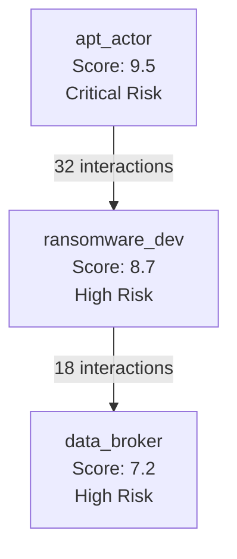
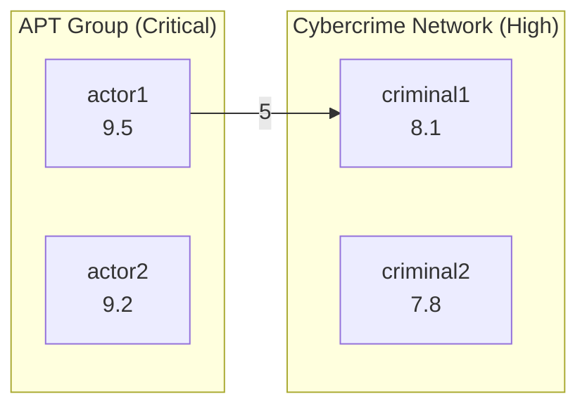
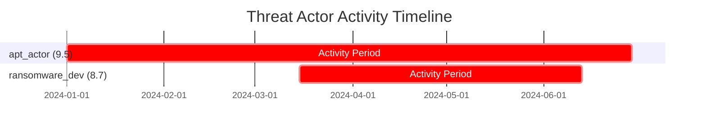

# SPECTRA Threat Scoring System - Usage Guide

## Overview

The SPECTRA Threat Scoring System provides advanced threat intelligence capabilities for Telegram data analysis. It automatically identifies threat actors, scores them on a 1-10 scale, tracks networks, and generates visualizations.

## Quick Start

### 1. Run the Demo

The easiest way to understand the system is to run the demo:

```bash
cd /path/to/SPECTRA
python examples/threat_scoring_demo.py
```

This will generate:
- Console output showing threat detection
- Mermaid network diagrams in `./threat_analysis_output/`
- Executive threat intelligence report

### 2. Basic Usage

```python
from tgarchive.threat import (
    ThreatIndicatorDetector,
    ThreatScorer,
    ThreatNetworkTracker,
    MermaidGenerator,
    ThreatReportGenerator
)

# Step 1: Detect threat indicators in messages
detector = ThreatIndicatorDetector()
indicators = detector.analyze_message(message_text, message_id=123)

# Step 2: Build actor profile and calculate threat score
profiles = []
for user_id, messages in user_messages.items():
    # Analyze all messages from this user
    all_indicators = []
    for msg in messages:
        inds = detector.analyze_message(msg['content'], msg['id'])
        all_indicators.extend(inds)

    # Calculate threat score
    threat_score, confidence = ThreatScorer.calculate_threat_score(
        keyword_indicators=[i for i in all_indicators if i.indicator_type == 'keyword'],
        pattern_indicators=[i for i in all_indicators if i.indicator_type == 'pattern'],
        behavioral_flags=[],  # Optional: add behavioral analysis
        network_threat_score=0.0,  # Will be calculated next
        message_count=len(messages),
        active_channels=set(msg['channel_id'] for msg in messages),
        first_seen=min(msg['date'] for msg in messages),
        last_seen=max(msg['date'] for msg in messages)
    )

    # Create profile
    profile = ThreatActorProfile(
        user_id=user_id,
        username=user_data.get('username'),
        threat_score=threat_score,
        confidence=confidence,
        keyword_indicators=[i for i in all_indicators if i.indicator_type == 'keyword'],
        pattern_indicators=[i for i in all_indicators if i.indicator_type == 'pattern'],
        behavioral_flags=[],
        message_count=len(messages),
        channels=set(msg['channel_id'] for msg in messages),
        first_seen=min(msg['date'] for msg in messages),
        last_seen=max(msg['date'] for msg in messages)
    )
    profiles.append(profile)

# Step 3: Track network relationships
network_tracker = ThreatNetworkTracker()

# Record interactions (replies, mentions, etc.)
for msg in all_messages:
    if msg.get('reply_to'):
        network_tracker.record_interaction(
            msg['user_id'],
            msg['reply_to']['user_id'],
            InteractionType.DIRECT_REPLY,
            msg['date'],
            msg['id']
        )

# Calculate network threat scores
actor_scores = {p.user_id: p.threat_score for p in profiles}
for profile in profiles:
    network_score = network_tracker.calculate_network_threat_score(
        profile.user_id,
        actor_scores
    )
    profile.network_threat_score = network_score

    # Recalculate total threat score with network component
    profile.threat_score, profile.confidence = ThreatScorer.calculate_threat_score(
        keyword_indicators=profile.keyword_indicators,
        pattern_indicators=profile.pattern_indicators,
        behavioral_flags=profile.behavioral_flags,
        network_threat_score=network_score,
        message_count=profile.message_count,
        active_channels=profile.channels,
        first_seen=profile.first_seen,
        last_seen=profile.last_seen
    )

# Step 4: Generate visualizations
mermaid_network = MermaidGenerator.generate_network_graph(
    profiles=profiles,
    network_tracker=network_tracker,
    max_nodes=50,
    min_interactions=3,
    title="Threat Actor Network"
)

# Save to file
with open('threat_network.md', 'w') as f:
    f.write(mermaid_network)

# Step 5: Generate threat intelligence report
report = ThreatReportGenerator.generate_executive_report(
    profiles=profiles,
    network_tracker=network_tracker
)

print(report)
```

## Threat Score Scale

| Score | Classification | Description |
|-------|---------------|-------------|
| 9-10 | **Critical Risk** | Nation-state actors, APT groups, major cybercrime operations |
| 7-8 | **High Risk** | Professional cybercriminals, malware developers, data brokers |
| 5-6 | **Medium Risk** | Script kiddies, low-level threat actors, suspicious activity |
| 3-4 | **Low Risk** | Security hobbyists, questionable but not clearly malicious |
| 1-2 | **Harmless** | Normal users, security researchers (with proper context) |

## Scoring Components

The threat score is calculated using a weighted multi-factor algorithm:

1. **Keyword Indicators (30%)**: Critical security keywords, threat actor terminology
2. **Pattern Indicators (25%)**: CVEs, malware hashes, crypto addresses, Tor URLs
3. **Behavioral Flags (20%)**: Activity patterns, OPSEC awareness, code sharing
4. **Network Associations (15%)**: "Guilt by association" with known threat actors
5. **Temporal Patterns (10%)**: Burst activity, coordinated operations

## Critical Keywords Detected

The system detects 100+ threat-related keywords, including:

**Critical (Score +5):**
- `zero-day`, `0day`
- `nation-state`, `state-sponsored`
- `apt28`, `apt29`, `lazarus group`
- `ransomware`, `backdoor`
- `data exfiltration`

**Moderate (Score +3):**
- `exploit`, `vulnerability`
- `malware`, `trojan`, `botnet`
- `phishing`, `credential harvesting`
- `darknet`, `tor hidden service`

**Low (Score +1):**
- `hacking`, `cracking`
- `penetration testing`
- `security research`

## Pattern Detection

Automatically detects and extracts:

- **CVE IDs**: `CVE-2024-1234`
- **IP Addresses**: `192.168.1.1`, `2001:db8::1`
- **Crypto Addresses**: Bitcoin, Ethereum, Monero
- **Malware Hashes**: MD5, SHA1, SHA256
- **Tor Addresses**: `.onion` domains
- **Suspicious URLs**: Phishing, malware distribution
- **Credentials**: Username:password patterns

## Network Analysis

### Interaction Types and Weights

- **Direct Reply** (1.0): Strongest signal of association
- **Forwarded Message** (0.9): Content sharing
- **Mention** (0.8): Explicit reference
- **Media Share** (0.7): File/photo sharing
- **Same Thread** (0.6): Conversational proximity
- **Same Channel** (0.3): Weakest signal

### Network Metrics

- **Degree Centrality**: Number of connections
- **PageRank**: Influence in network
- **Betweenness Centrality**: Network bridge position
- **Community Detection**: Clustered threat groups

## Mermaid Visualizations

### Network Graph

Shows threat actors as color-coded nodes with connections:



**Color Scheme:**
- 🔴 **Red**: Critical Risk (9-10)
- 🟠 **Orange**: High Risk (7-8)
- 🟡 **Yellow**: Medium Risk (5-6)
- 🟢 **Green**: Low Risk (3-4)
- 🟢 **Light Green**: Harmless (1-2)

### Community Graph

Shows clustered threat networks:



### Timeline

Shows actor activity periods as Gantt chart:



## Integration with SPECTRA Database

To integrate with existing SPECTRA database:

```python
import sqlite3
from tgarchive.threat import ThreatIndicatorDetector, ThreatScorer

# Connect to database
conn = sqlite3.connect('data/channels.db')
cursor = conn.cursor()

# Get all messages for analysis
cursor.execute("""
    SELECT id, channel_id, user_id, text, date, reply_to_message_id
    FROM messages
    WHERE text IS NOT NULL AND text != ''
    ORDER BY date ASC
""")

messages = cursor.fetchall()

# Analyze messages
detector = ThreatIndicatorDetector()
user_indicators = {}

for msg_id, channel_id, user_id, text, date, reply_to in messages:
    indicators = detector.analyze_message(text, msg_id)

    if user_id not in user_indicators:
        user_indicators[user_id] = []
    user_indicators[user_id].extend(indicators)

# Create threat profiles for all users
# (continue with profiling as shown in basic usage)
```

## Advanced Features

### Custom Keyword Lists

Add domain-specific keywords:

```python
detector = ThreatIndicatorDetector()

# Add custom critical keywords
detector.critical_keywords.update({
    'internal_code_name',
    'project_mercury',
    'operation_nightfall'
})

# Add custom patterns
import re
detector.pattern_detector.custom_patterns.append(
    re.compile(r'\b(PROJECT-\d{4})\b')
)
```

### Behavioral Analysis

Add custom behavioral flags:

```python
from tgarchive.threat.scoring import BehavioralFlag

flags = []

# Detect unusual activity patterns
if message_count > 1000 and days_active < 30:
    flags.append(BehavioralFlag(
        flag_type="high_volume_burst",
        severity=4,
        description="Extremely high message volume in short time"
    ))

# Detect OPSEC awareness
if any(keyword in text.lower() for keyword in ['vpn', 'proxy', 'encryption']):
    flags.append(BehavioralFlag(
        flag_type="opsec_awareness",
        severity=3,
        description="Shows operational security awareness"
    ))
```

### Community Detection

Identify threat networks:

```python
communities = network_tracker.detect_communities(algorithm='louvain')

# Group by community
for comm_id, members in communities.items():
    avg_score = sum(profiles[uid].threat_score for uid in members) / len(members)
    print(f"Community {comm_id}: {len(members)} members, avg score: {avg_score:.1f}")
```

## Performance Considerations

- **Batch Processing**: Process messages in batches of 1000-10000 for efficiency
- **Caching**: Indicator detection results are cached per message
- **Database Indexing**: Ensure proper indexes on `user_id`, `date`, `channel_id`
- **Memory Usage**: For large datasets (millions of messages), process incrementally

## Security and Privacy

⚠️ **Important Considerations:**

1. **False Positives**: Security researchers and ethical hackers may trigger high scores
2. **Context Matters**: Always review high-scoring actors manually
3. **Legal Compliance**: Ensure compliance with data protection laws
4. **Access Control**: Restrict access to threat scoring data
5. **Bias Mitigation**: Regular review of keyword lists for cultural/language bias

## Troubleshooting

### Low Confidence Scores

If confidence scores are consistently low:
- Increase message sample size (need more data)
- Check if messages contain substantive content
- Verify date ranges are populated

### Missing Network Connections

If network graph is sparse:
- Lower `min_interactions` threshold
- Check that reply tracking is working
- Verify message threading is captured

### Mermaid Rendering Issues

If Mermaid diagrams don't render:
- Use Mermaid Live Editor: https://mermaid.live
- Check for special characters in usernames
- Verify diagram syntax with online validator

## Example Outputs

### Console Output

```
=== THREAT INDICATOR DETECTION DEMO ===

Message 1 - Critical Threat Indicators:
--------------------------------------------------
"Looking for zero-day exploits in popular browsers..."

Detected Indicators:
  [CRITICAL] Keyword: zero-day (Severity: 5)
  [CRITICAL] Pattern: CVE-2024-1234 (Type: cve_id, Severity: 4)

Total Score Impact: +9 points


=== ACTOR PROFILING DEMO ===

Actor: apt_actor_001 (ID: 1001)
--------------------------------------------------
Threat Score: 9.5 / 10.0
Confidence: 95%
Classification: Critical Risk - Nation State / APT
Messages Analyzed: 50
Active Channels: 3
Activity Period: 2024-01-01 to 2024-06-30

Indicators Summary:
  - Keyword matches: 15 (avg severity: 4.2)
  - Pattern matches: 8 (avg severity: 3.5)
  - Behavioral flags: 2
  - Network threat score: 8.3
```

### Threat Intelligence Report

```markdown
# THREAT INTELLIGENCE REPORT
**Generated:** 2024-06-30 12:00:00 UTC
**Report ID:** TIR-20240630-120000

## Executive Summary

- **Total Actors Monitored:** 1,245
- **Critical Threat Actors (9-10):** 12 (1.0%)
- **High Threat Actors (7-8):** 45 (3.6%)
- **Total Interactions Tracked:** 25,430
- **Active Threat Networks:** 5 identified clusters

## Top Threat Actors

### 1. apt_actor_001 (Score: 9.5, Confidence: 95%)
**Classification:** Critical Risk - Nation State / APT

**Indicators:**
- 15 keyword matches: zero-day, nation-state, apt28
- 8 pattern matches: cve_id, tor_address, bitcoin_address
- 2 behavioral flags: code_sharing, opsec_awareness

**Network:**
- Direct connections: 23
- Network threat score: 8.3

**Activity:**
- First seen: 2024-01-01
- Last seen: 2024-06-30
- Message count: 456
- Active channels: 3

**Recommended Action:** 🚨 CRITICAL - Immediate analyst review required

---
```

## Further Reading

- **System Architecture**: See `docs/THREAT_SCORING_SYSTEM_PLAN.md`
- **Implementation Guide**: See source code in `tgarchive/threat/`
- **Demo Script**: See `examples/threat_scoring_demo.py`

## Support

For issues or questions:
- Check existing GitHub issues
- Review source code documentation
- Run the demo script for working examples
